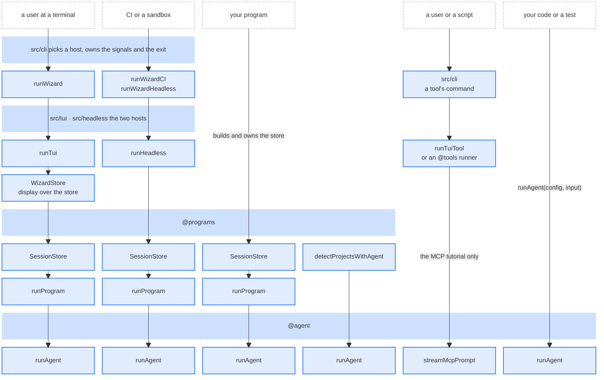

<p align="center">
  
</p>


> have any feedback, please drop an email to **[wizard@posthog.com](mailto:wizard@posthog.com)**.

<h1>PostHog wizard ✨</h1>

The PostHog wizard helps you quickly add PostHog to your project using AI.


# Usage

To use the wizard, you can run it directly using:

```bash
npx @posthog/wizard@latest
```

Currently the wizard can be used for over 16+ frameworks for frontend, backend, and mobile applications. If you have other integrations you would like the wizard to
support, please open a [GitHub issue](https://github.com/posthog/wizard/issues)!

Visit our [docs](https://posthog.com/docs/ai-engineering/ai-wizard) to learn more. 

## Privacy & data usage

The wizard uses **AI models from Anthropic or OpenAI**, routed through PostHog's AI gateway, to read your project's source files and integrate PostHog. A few things worth knowing up front:

- **Source files** are sent to the selected model provider as part of the agent's context.
- **`.env*` files and secrets** stay on your machine. The wizard's security scanner blocks anything it identifies as a secret from being read by the agent.
- **Telemetry** (run metadata — phase, task list, planned events) is sent to PostHog by default. Pass `--no-telemetry` (or set `POSTHOG_WIZARD_NO_TELEMETRY=1`) to disable.
- **AI opt-in**: for existing organizations in interactive runs, the wizard checks `is_ai_data_processing_approved` and waits for approval before agent work. CI and signup runs bypass this interactive gate.
- **Prefer your own AI?** The wizard's integration knowledge ships as a context-mill skill you can download and run inside your own agent.

The wizard's "Privacy & data" menu (intro screen) and the `[I]` shortcut on the auth screen surface the same information in-terminal.

## MCP Commands

The wizard also includes commands for managing PostHog MCP (Model Context
Protocol) servers:

```bash
# Install PostHog MCP server to supported clients
npx @posthog/wizard@latest mcp add

# Remove PostHog MCP server from supported clients
npx @posthog/wizard@latest mcp remove

# Try the PostHog MCP with your agent, no install needed
npx @posthog/wizard@latest mcp tutorial
```

These, `slack`, `doctor`, `provision`, `cli add` and `skill list` are tools:
commands that do their job without an agent run. See
[src/tools](src/tools/README.md).

## Wizard programs

The wizard's commands are grouped into **programs** — self-contained agentic jobs that install, audit, or wire up a specific piece of PostHog. They're powered by skills from the [context mill](https://github.com/PostHog/context-mill).

### PostHog integration (default)

Running the wizard with no arguments installs PostHog into your project. It detects your framework, wires up initialization, instruments a starter set of events, and walks you through a first dashboard:

```bash
npx @posthog/wizard@latest
```

Powered by the `posthog-integration` program. Most other programs below build on it and declare `requires: ['posthog-integration']`.

### Self-driving

Autonomously sets up PostHog self-driving end-to-end. It connects GitHub, enables Session Replay and Error Tracking, wires up signal sources, and configures a Signals scout troop that watches your project for you.

```bash
npx @posthog/wizard@latest self-driving
```

If PostHog isn't already installed, the wizard runs the default integration first (composed run) before starting the self-driving setup.

### Audit

Audit an existing PostHog integration for correctness and best practices. The
`audit` command is a **family**. With no subcommand, an interactive terminal
runs the audit the skill menu marks as the default (today **all**); pass a
subcommand to run a specific one:

```bash
# Runs the default audit — no subcommand needed
npx @posthog/wizard@latest audit

# Or run a specific audit directly
npx @posthog/wizard@latest audit events           # event capture quality + cost
npx @posthog/wizard@latest audit all              # comprehensive audit across every area (default)
npx @posthog/wizard@latest audit autocapture      # autocapture setup + cost
npx @posthog/wizard@latest audit feature-flags    # feature flag usage + cost
npx @posthog/wizard@latest audit identify         # your $identify implementation
npx @posthog/wizard@latest audit session-replay   # session replay setup
npx @posthog/wizard@latest audit web-analytics    # web analytics setup
```

Most audit subcommands resolve at runtime from the published skill registry, so
new audits appear without a wizard release (`web-analytics` is wizard-native).

> **`audit <subcommand>` chooses an audit area — it does not take a skill name.**
> The audit subcommands above *are* context-mill skills promoted to commands (via
> a `cli: role: command` block); [`wizard skill <skill-name>`](#run-skill)
> runs a skill that hasn't been promoted. Same machinery, two surfaces.
> (`wizard audit --help` labels the positional `[skill]` — read it as "pick
> a subcommand.")

### Revenue Analytics

Wire up an existing PostHog + Stripe project for revenue analytics:

```bash
npx @posthog/wizard@latest revenue-analytics
```

Requires PostHog and Stripe SDKs already installed. Supports `--ci` with the
same flags as the main wizard.

### Data Warehouse

Detect data sources your project already uses (Postgres, MySQL, MongoDB,
Snowflake, BigQuery, Stripe, …) and connect them to PostHog's data warehouse:

```bash
npx @posthog/wizard@latest warehouse
```

The wizard scans your dependencies and `.env` key names (never the values) to
identify sources. Database and API-key sources are created from the terminal;
OAuth sources open the PostHog app's new-source flow in your browser.

### Upload source maps

Upload JavaScript source maps to PostHog error tracking so stack traces are symbolicated back to your original code:

```bash
npx @posthog/wizard@latest upload-source-maps
```

### Run skill

Run any context-mill skill directly by name, even if it isn't exposed as its own
command:

```bash
npx @posthog/wizard@latest skill list              # list every available skill
npx @posthog/wizard@latest skill <skill-name>      # run one by name
```

## Wizard ownership

Reviews are auto-requested via [`.github/CODEOWNERS`](.github/CODEOWNERS) — the
file is the source of truth; this table just mirrors it for readability.
`team-wizard-docs` is the default reviewer; the team-owned paths below
route review to their owning team instead.

| Path | Owning team |
|---|---|
| `*` (everything else, including all other programs) | `@PostHog/team-wizard-docs` |
| `src/agent/` | `@PostHog/team-wizard-docs` |
| `src/programs/ai-observability/` | `@PostHog/team-ai-observability` |
| `src/programs/posthog-integration/` | `@PostHog/team-wizard-docs` |
| `src/programs/error-tracking-upload-source-maps/` | `@PostHog/team-error-tracking` |
| `src/programs/mcp-analytics/` | `@PostHog/team-mcp-analytics` |
| `src/programs/metrics/` | `@PostHog/apm` |
| `src/programs/replay-vision/` | `@PostHog/team-replay` |
| `src/programs/revenue-analytics/` | `@PostHog/team-web-analytics` |
| `src/programs/self-driving/` | `@PostHog/team-self-driving` |
| `src/programs/warehouse-source/` | `@PostHog/team-warehouse-sources` |
| `src/programs/web-analytics-doctor/` | `@PostHog/team-web-analytics` |
| `src/tui/programs/error-tracking-upload-source-maps/` | `@PostHog/team-error-tracking` |
| `src/tui/programs/revenue-analytics/` | `@PostHog/team-web-analytics` |
| `src/tui/programs/self-driving/` | `@PostHog/team-self-driving` |
| `src/tui/programs/warehouse-source/` | `@PostHog/team-warehouse-sources` |

Ownership is by directory. Programs not listed above
(`agent-skill`, `audit`, `error-tracking`, `migration`), the shared program code
and the tools (`src/tools`, `src/tui/tools`) fall through the default and are
owned by `team-wizard-docs`. Today CODEOWNERS only auto-requests review —
approval is not a merge gate.

## Headless signup + install (agents / CI)

> ⚠️ `--ci` is **not currently supported in published builds** (see [CI Mode](#ci-mode)).
> This flow works in development builds only.

For a fully non-interactive first-run (no existing PostHog account, no TTY,
no browser), combine `--ci --signup --email`. The wizard provisions a new
account, uses the returned personal API key to run the normal CI install,
and wires PostHog into the project at `--install-dir`. Like every `--ci` run, it
needs the gateway token file from [local
credentials](docs/local-dev.md#credentials-for-local-ci-and-headless-runs):

```bash
npx @posthog/wizard@latest --ci --signup \
  --email you@example.com \
  --install-dir .
```

Optional flags: `--name "Your Name"`, `--region eu` (default `us`).

### Provision only

If you just want credentials — for tests, pre-flight checks, or wiring up
PostHog yourself — use the `provision` subcommand, which emits a structured
`ProvisioningResult` and does nothing else:

```bash
# Human-readable (when stdout is a TTY)
npx @posthog/wizard@latest provision --email user@example.com --region us

# Machine-readable — auto when stdout is piped, or force with --json
npx @posthog/wizard@latest provision --email user@example.com --region eu --json
```

Success prints `projectApiKey`, `host`, `projectId`, `accountId`, `accessToken`,
`refreshToken`, and `personalApiKey` if present. `--json` prints the full
`ProvisioningResult`, which also has `expiresAt` and `oauthClientId`. Failure
exits 1; in `--json` mode the error is emitted to stderr as
`{"error":"...","code":"..."}`, with `code` set to `email_exists` when the
address is already registered.

> ⚠️ **Output contains live credentials.** Pipe it into a secrets store —
> do not let it be captured by shared CI logs. Mask the step output or
> redirect stdout to a file your job reads and discards.

# Options

The following CLI arguments are available:

| Option            | Description                                                      | Type    | Default | Choices                                              | Environment Variable           |
| ----------------- | ---------------------------------------------------------------- | ------- | ------- | ---------------------------------------------------- | ------------------------------ |
| `--help`          | Show help                                                        | boolean |         |                                                      |                                |
| `--version`       | Show version number                                              | boolean |         |                                                      |                                |
| `--debug`         | Enable verbose logging                                           | boolean | `false` |                                                      | `POSTHOG_WIZARD_DEBUG`         |
| `--signup`        | Create a new PostHog account during setup                        | boolean | `false` |                                                      | `POSTHOG_WIZARD_SIGNUP`        |
| `--install-dir`   | Directory to install PostHog in                                  | string  |         |                                                      | `POSTHOG_WIZARD_INSTALL_DIR`   |
| `--ci`            | Enable CI mode for non-interactive execution (dev and test builds only) | boolean | `false` |                                                      | `POSTHOG_WIZARD_CI`            |
| `--api-key`       | PostHog personal API key (phx_xxx) for authentication            | string  |         |                                                      | `POSTHOG_WIZARD_API_KEY`       |
| `--no-telemetry`  | Disable wizard run-state telemetry                               | boolean | `false` |                                                      | `POSTHOG_WIZARD_NO_TELEMETRY`  |


# CI Mode

**CI mode is available only in development/test builds.** Published builds
reject `--ci`; use an interactive terminal for `npx @posthog/wizard@latest`.

Local CI runs require a PostHog personal API key for MCP access **and a
separate gateway token file** holding the gateway service key from 1Password,
plus the target project ID. See
[local credentials](docs/local-dev.md#credentials-for-local-ci-and-headless-runs)
for setup and the CI secret names. With both secrets configured:

```bash
WIZARD_CI_GATEWAY_TOKEN_FILE="$HOME/.config/posthog/wizard-gateway-token" \
pnpm try --ci --api-key "$POSTHOG_PERSONAL_API_KEY" \
  --project-id 12345 --region us --install-dir /absolute/path/to/test-app
```

When running in CI mode (`--ci`):

- Bypasses OAuth login flow (uses personal API key directly)
- Auto-selects defaults for all prompts
- Skips MCP server installation
- Auto-consents to AI usage

The CLI args override environment variables in CI mode.

### Required Flags for CI Mode

- `--api-key`: Personal API key (`phx_xxx`) from your [PostHog settings](https://app.posthog.com/settings/user-api-keys)
- `--install-dir`: Directory to install PostHog in (e.g., `.` for current directory)

### Required API Key Scopes

When creating your personal API key, grant it the wizard's base scope set:

```
user:read project:read organization:read llm_gateway:read query:read
dashboard:write insight:write notebook:write event_definition:write
health_issue:read wizard_session:read wizard_session:write wizard_run:write
```

The source of truth is `WIZARD_OAUTH_SCOPES` in `src/shared/constants.ts`, which
documents why each scope is needed — if this block drifts, trust the code.
Some programs request more on top (`oauthScopeAdditions` on the program's
config); the default integration flow adds
`integration:read` and `external_data_source:read` /
`external_data_source:write`.

The `wizard-run-sync` flag selects remote synchronization: `wizard-session`
(the default) uses WizardSession; `wizard-run` uses WizardRun. In the latter
mode, local executions synchronize tasks and terminal status. Cloud executions
require an explicit `POSTHOG_WIZARD_RUN_ID` assignment and leave terminal status
to their worker. See [WizardRun synchronization](docs/local-dev.md#wizardrun-synchronization)
for limits, shutdown behavior, migration compatibility, and deployment checks.

### OAuth app scope ceiling

Both the interactive and cloud Wizard OAuth apps must allow `wizard_run:write`
in every deployed region. Run synchronization needs no read scope.

The wizard's OAuth app on the PostHog side caps the scopes its tokens may
carry (`OAuthApplication.scopes`). Any scope requested in this repo (see
the programs' `oauthScopeAdditions`) must be grantable under that ceiling, or
`/authorize` drops it and the call that needs it 403s.

**A granted token can be narrower than the request even with a correct
ceiling.** The consent screen lets the user deselect any scope the app doesn't
mark required (`OAuthApplication.required_scopes`), and out-of-ceiling scopes
are clamped silently (`clamp_scopes_to_ceiling`) — neither path errors;
`/oauth/token` just returns a smaller `scope`. So never assume the token
carries what was requested: the token response's `scope` field is the truth.
The wizard diffs granted vs requested at login (`missingOAuthScopes` in
`src/programs/oauth/tokens.ts`), warns the user which permissions are missing, and
emits `wizard: oauth grant narrowed` so narrowed runs are countable in analytics.
The diff also rides on the session (`credentials.missingScopes`), so when a
run does fail on a scope-gated step, the error names the missing permission
and the fix instead of the generic report-a-bug line.

**To make scopes impossible to deselect, list them explicitly in the app's
`scopes`.** `required_scopes` is not a separate field — it is derived
(`posthog/models/oauth.py`): every explicit `obj:action` entry in `scopes` is
required and locked at consent (the UI force-includes those rows, and the
consent POST 400s with `invalid_scope` if the grant misses one), while scopes
covered only by `@default` stay deselectable and `optional_scopes` are
declinable extras. That is why `llm_gateway:read` and `wizard_session:*` are
already un-deselectable today, and everything else is not. To pin the base set
the wizard cannot run without, seed each region's app with `@default` plus
every scope in `WIZARD_OAUTH_SCOPES`:

```
python manage.py seed_oauth_app_scopes --client-id <id> --dry-run \
  --scopes "@default,llm_gateway:read,wizard_session:read,wizard_session:write,wizard_run:write,user:read,project:read,organization:read,query:read,dashboard:write,insight:write,notebook:write,event_definition:write,health_issue:read"
```

then re-run without `--dry-run`. Keep `@default` in the list — dropping it
narrows the ceiling to only the explicit entries and strips the
program-specific additions. The wizard has no client-side lever for any of
this; the login diff and prompt-threaded degrade above handle a narrowed
grant, but only pinning prevents one.

**The live wizard apps use the `@default` sentinel, so most net-new scopes need
no ceiling edit.** The prod US app's `scopes` is:

```
@default,llm_gateway:read,wizard_session:read,wizard_session:write
```

`@default` resolves (in `posthog/scopes.py`, `resolve_ceiling`) to
`UNPRIVILEGED_SCOPES` — **every** public `obj:action` scope except three
excluded sets: privileged (`llm_gateway:*`), internal-only objects, and
hidden/alpha objects. It auto-tracks unprivileged scopes added to PostHog later,
which is the whole reason it exists. The three explicit entries alongside it are
exactly the ones `@default` excludes and that the wizard still needs
(`llm_gateway:read` is privileged; the `wizard_session:*` pair is
provisioning-only).

So the rule for a net-new scope this repo starts requesting is:

- **A normal public scope object** (`replay_scanner`, `product_enablement`,
  `task`, `signal_scout`, `external_data_source`, `llm_skill`, …) — already
  inside `@default`. **No ceiling edit.** Confirm with
  `python manage.py seed_oauth_app_scopes --client-id <id> --scopes @default,… --dry-run`
  (posthog), or evaluate the requested scope against `resolve_ceiling`.
- **A privileged, internal, or hidden object** — `@default` deliberately
  excludes it, so it must be added explicitly to each app's `scopes` (Django
  admin / the `seed_oauth_app_scopes` command), per region. This is the only
  case that needs a manual prod edit.

Client IDs are per-region DB rows, not committed here — the prod US app is
`c4Rdw8DIxgtQfA80IiSnGKlNX8QN00cFWF00QQhM`, the dev app (localhost:8010) is
`DC5uRLVbGI02YQ82grxgnK6Qn12SXWpCqdPb60oZ`; the prod EU app's ID lives in the EU
deployment (referenced via `WIZARD_CLOUD_RUN_OAUTH_CLIENT_ID`) and should be
seeded the same `@default,…` way.

If an existing Wizard authorization predates a newly required scope, reconnect
the Wizard OAuth app. Refresh tokens retain their original grant and cannot be
used to silently add permissions.

# Command changes (CLI overhaul)

The CLI was overhauled to consolidate commands into a smaller, extensible
surface. If you used an older command, here's where it went:

| Old command | New command | What changed |
|---|---|---|
| `wizard integrate` | `wizard` (default flow) | Command removed; the default flow runs the integration |
| `wizard events-audit` | `wizard audit events` | Now an `audit`-family subcommand |
| `wizard audit` (single audit) | `wizard audit <subcommand>` | Now a family; see [Audit](#audit) for the subcommands |
| `wizard audit-3000` | *removed* | Retired |
| `wizard revenue` | `wizard revenue-analytics` | Renamed (old `revenue` removed) |
| `wizard upload-sourcemaps` | `wizard upload-source-maps` | Renamed; `upload-sourcemaps` still works as an alias |

> **Commands vs. programs:** `integrate` was the *command*; the program behind it
> is `posthog-integration`, which still exists and now powers the default flow.
> Other commands depend on it via `requires: ['posthog-integration']`. The
> program id is internal — it was never a command you typed.

# Steal this code

While the wizard works great on its own, we also find the approach used by this
project is
[a powerful way to improve AI agent coding sessions](https://posthog.com/blog/envoy-wizard-llm-agent).
Agents can run CLI tools, which means that conventional code like this can
participate in the AI revolution as well – with all the benefits and control
that conventional code implies.

If you want to use this code as a starting place for your own project, here's a
quick explainer on its structure.

## What calls what



Each column is one way in, read top to bottom. A box that repeats across columns
is the same code. The CLI calls one of two hosts, the TUI or headless. They
share only the kind of session store they build: each builds its own, calls
`runProgram` with it, and `runProgram` writes the run into it. The TUI draws its
screens from the `WizardStore` on top of its store, and headless prints and
streams the run.

A tool's command runs no program. The CLI calls the TUI's `runTuiTool` for the
tool's screens, or a console runner from `@tools`. Only the MCP tutorial reaches
the agent, through `streamMcpPrompt`. The TUI's intro can also hand off to a
tool's screens, such as `doctor`, in the same process. See
[src/tools](src/tools/README.md).

Detection calls `runAgent` directly. `detectProjectsWithAgent` builds its own
run config for a project scan. It runs from a program's `ciPreRun`, which
`runProgram` calls as a CI run's detection, and from the TUI's detect screens.

Dashed boxes are callers that build against a checkout of this repository, not
the npm package. Your program can build a store and call
`runProgram(id, { store })` itself. Your code can call `runAgent` with no
program at all.

| Box                               | What it is                                                                                                              | Where                                                                  |
| --------------------------------- | ----------------------------------------------------------------------------------------------------------------------- | ---------------------------------------------------------------------- |
| `runWizard`                       | Builds the launch values from the arguments and starts the TUI host                                                     | [src/cli/runners](src/cli/runners/run-wizard.ts)                       |
| `runWizardCI · runWizardHeadless` | Checks the non-interactive arguments and starts the headless host                                                       | [src/cli/runners](src/cli/runners)                                     |
| `a tool's command`                | Parses the tool's arguments and calls its runner                                                                        | [src/cli/commands](src/cli/commands)                                   |
| `runTui`                          | The full-screen wizard: OAuth login, the WizardAsk screen as the answerer, the flow's screens as the workflow           | [src/tui/run.ts](src/tui/run.ts)                                       |
| `runHeadless`                     | A run with no screens: API-key login, no answerer, log lines and the task stream                                        | [src/headless/run.ts](src/headless/run.ts)                             |
| `runTuiTool`                      | Shows a tool's screens on their own store and resolves the code a screen exits with; it runs no program                 | [src/tui/run-tool.ts](src/tui/run-tool.ts)                             |
| `@tools` runner                   | A tool that runs on the console, such as `addMCPServerToClientsStep`, `runDoctorReport`, `runProvision` or `listSkills` | [src/tools](src/tools/README.md)                                       |
| `WizardStore`                     | The TUI's own state (the screens' answers), router, gates, overlays and display state, over its session store           | [src/tui/store.ts](src/tui/store.ts)                                   |
| `SessionStore`                    | Launch values, detection, the login and the run's progress; each host builds its own                                    | [src/programs/session](src/programs/session)                           |
| `runProgram`                      | Runs a registered program: detection, readiness, login, the host's steps, then each agent run                           | [src/programs/run-program.ts](src/programs/run-program.ts)             |
| `detectProjectsWithAgent`         | A project scan: one `runAgent` call per attempt, with its own route and deadline                                        | [src/programs/detection/agentic.ts](src/programs/detection/agentic.ts) |
| `runAgent`                        | One agent run from a `RunConfig` and `RunInput`; complete on its own                                                    | [src/agent](src/agent/README.md)                                       |
| `streamMcpPrompt`                 | The MCP tutorial's prompt stream: one prompt against the PostHog MCP server, with its own SDK call                      | [src/agent/mcp-prompt-streaming.ts](src/agent/mcp-prompt-streaming.ts) |

## Entrypoint: `bin.ts`

The entrypoint for this tool is `bin.ts`. It checks the Node version, and only
then loads `main.ts` with a dynamic import, so no dependency runs on an old
Node. `main.ts` sets the HTTP/1.1 dispatcher, restores any Claude settings
backup an interrupted run left behind, and calls `runCli()` from
`src/cli/index.ts`. `runCli` registers each command on the yargs setup in
`src/cli/wizard.ts` and runs the one that `process.argv` names.

## Analytics

Did you know you can capture PostHog events even for smaller, supporting
products like a command line tool? `src/shared/utils/analytics.ts` is a great example
of how to do it.

This file wraps `posthog-node` with some convenience functions to set up an
analytics session and log events. We can see the usage and outcomes of this
wizard alongside all of our other PostHog product data, and this is very
powerful. For example: we could show in-product surveys to people who have used
the wizard to improve the experience.

With `wizard-run-sync=wizard-session`, the wizard streams live run state — current
phase, task list, planned events — to `POST /api/projects/{id}/wizard/sessions/`
so the PostHog web app can render real-time progress. Updates are debounced
(250ms) with phase changes flushed immediately; failures fall back silently to
the wizard's debug log without disturbing the TUI. Pass `--no-telemetry` (or
set `POSTHOG_WIZARD_NO_TELEMETRY=1`) to disable either remote transport.

## Leave rules behind

Supporting agent sessions after we leave is important. There are plenty of ways
to break or misconfigure PostHog, so guarding against this is key.

`src/shared/utils/rules/` holds per-framework rule templates in Markdown. No
code reads them or writes them into a project today.

## Prompts and LLM interactions

LLM agent sessions are _anti-deterministic_: really, anything can happen.

But using LLMs for code generation is really advantageous: they can interpret
existing code at scale and then modify it reliably.

_If_ they are well prompted.

`src/agent/agent-prompt.ts` demonstrates how to wrap a deterministic fence
around a chaotic process. Every wizard session gets the same prompt, tailored to
the specific files in the project.

These prompts go to the PostHog LLM gateway, an LLM interface we
host, with a scoped token that `src/agent/gateway-session.ts` mints for each
run. This gives us more control: we can be certain of the model version and
provider which interpret the prompts and modify the files. This way, we can find
the right tools for the job and again, apply them consistently.

This also allows us to pick up the bill on behalf of our customers.

When we make improvements to this process, these are available instantly to all
users of the wizard, no training delays or other ambiguity.

## Keep secrets out of the LLM

The wizard somtimes needs to move a secret. The agent
orchestrates that journey, but the raw value should _never_ enter the LLM
conversation, where it would be sent to the model provider, written to
transcripts, and captured in logs.

`src/shared/secret-vault.ts` is a small, reusable pattern for exactly this. It's a
session-scoped, in-memory vault: a tool that handles a secret calls `put()` to
store the raw value and hands the agent an opaque `secret:<uuid>` reference
instead. The agent passes that ref between tools as if it were the value; the
host resolves it back to the real secret only at the last moment, inside the
process, when it writes the file.

Two tools in `src/agent/tools/tools.ts` form the ends of that pipe:

- `wizard_ask` with `sensitive: true` vaults the user's typed answer and returns
  `{ secretRef: "secret:..." }` to the agent rather than the string.
- `set_env_values` accepts `{ secretRef }` in place of a literal value and
  resolves it against the vault before writing — the value lands in the `.env`
  file but is never returned to the model.

The vault has no persistence and is dropped at the end of the run; refs minted
in one session can't be resolved in another. The net effect: the model gets to
drive the work end to end, but the only thing it ever sees is an opaque handle.

## Build system

Built with [tsdown](https://tsdown.dev/) (Rolldown). `pnpm build` bundles `bin.ts` into ESM chunks in `dist/`, inlining all local source and keeping npm dependencies external.

### Environment variables

**Build-time (locked).** `pnpm build` replaces `NODE_ENV` with `"production"` at compile time. It cannot be overridden at runtime. All URLs, OAuth client IDs, and dev-mode code paths resolve to their production values. `pnpm build:ci` inlines `ci` instead, which keeps dev and test flags such as `--ci`.

To add a new build-time constant, add it to `env` in `tsdown.config.ts` and export it from `src/env.ts`.

**Runtime (allowlisted).** Most runtime env reads go through `runtimeEnv()` in `src/env.ts`, which only accepts keys in the `RuntimeEnvKey` union:

| Variable | Purpose |
|---|---|
| `POSTHOG_WIZARD_BENCHMARK_CONFIG` | Path to benchmark config file |
| `POSTHOG_WIZARD_BENCHMARK_FILE` | Output path for benchmark results |
| `POSTHOG_WIZARD_LOG_DIR` | Log directory override |
| `POSTHOG_WIZARD_RUN_ID` | Assigned cloud WizardRun id |
| `POSTHOG_TASK_RUN_ID`, `POSTHOG_TASK_ID`, `POSTHOG_HANDOFF_OUTPUT_PATH` | The PostHog task run that launched the wizard |
| `WIZARD_CI_GATEWAY_TOKEN_FILE`, `WIZARD_CI_GATEWAY_URL` | The gateway token and URL for `--ci` runs |
| `WIZARD_CI_FLAG_OVERRIDES`, `WIZARD_CI_EXCLUDE_TASKS` | Flag and task overrides for CI builds |
| `MCP_URL` | Override MCP server URL |
| `APPDATA`, `XDG_CONFIG_HOME`, `OPENCODE_CONFIG_DIR` | Platform path resolution |

To add a new runtime env var, add its key to `RuntimeEnvKey` in `src/env.ts`.
The CLI reads every `POSTHOG_WIZARD_*` variable as an option and rejects unknown
ones, so a CLI run with `POSTHOG_WIZARD_BENCHMARK_CONFIG`,
`POSTHOG_WIZARD_BENCHMARK_FILE` or `POSTHOG_WIZARD_WARLOCK_DISABLED` set exits
with `Unknown argument`. `POSTHOG_WIZARD_LOG_FILE` is the exception: it is the
env form of `--log-file`, a declared option that moves the debug log from its
default, `posthog-wizard.log` in the temp directory.

**Direct `process.env` access** covers terminal detection (`TERM`, `TERM_PROGRAM`, `CI`, …), subprocess environment writes (e.g. `agent-interface.ts` setting `ANTHROPIC_BASE_URL`), a few launch-time reads, vendored code, and tests.

### Import aliases

Path aliases defined in `tsconfig.base.json`, resolved by tsdown and `tsx`:

| Alias | Maps to |
|---|---|
| `@env` | `src/env.ts` |
| `@shared/*` | `src/shared/*` |
| `@utils/*` | `src/shared/utils/*` |
| `@host/*` | `src/host/*`, how a run ends (`startHostExit`, `wizardAbort`, `registerShutdown`), for headless, the TUI, the CLI and the e2e harness |
| `@agent` | `src/agent/index.ts`, the agent's runtime entry |
| `@agent/types` | `src/agent/types.ts`, type-only |
| `@agent/*` | `src/agent/*`, for the agent's tests. The agent imports its own modules by relative path, and no other layer maps it |
| `@programs` | `src/programs/index.ts`, the programs runtime entry |
| `@programs/types` | `src/programs/types.ts`, type-only |
| `@programs/<id>` | `src/programs/<id>/index.ts`, one program's entry. Other layers reach nothing else in a program folder |
| `@programs/*` | `src/programs/*`. Other layers reach only the `@programs/<id>` entries; the programs import their own code by relative path, and only their tests use this alias |
| `@tools` | `src/tools/index.ts`, the tools' one entry: the commands that run no agent. The TUI and the CLI import it; programs never do |
| `@tui` | `src/tui/index.ts`, the TUI's one entry, for the CLI and the e2e harness |
| `@tui/*` | `src/tui/*`. Only the TUI's own projects may use it |
| `@headless` | `src/headless/index.ts`, headless's one entry, for the CLI |
| `@cli` | `src/cli/index.ts`, the CLI's one entry, for `main.ts` |
| `@cli/*` | `src/cli/*`. Only the CLI may use it |
| `@e2e-harness/*` | `e2e-harness/*`, for the harness, scripts and tests |

Each layer's tsconfig project `references` only the layers it may import, so
`pnpm typecheck` rejects an import of any other. Outside the TUI, `ink`,
`react`, `@inkjs/ui` and `ink-testing-library` resolve to a fence that fails
every import form, and no layer imports JSON. `pnpm lint` rejects the paths the
compiler can't see: a relative import that leaves its layer's folder, a deep
alias outside its own layer, a `.tsbuild/` or `node_modules/` path, `module`
loaders and a bare `require`, triple-slash references, and the hosts importing
the agent's runtime. See
[layer boundaries](.claude/skills/wizard-development/references/ARCHITECTURE.md#layer-boundaries)
for what each layer may import and why each rule exists. Code outside a layer
imports it only through the entries above. The e2e harness, scripts and
`docs/examples` are one layer project, `e2e-harness/tsconfig.json`. Tests follow
the same rule: each layer's tests sit in its project, and a test mocks another
layer through its entry.

## Running locally

For `--ci`, smoke tests, and full headless runs, configure both the personal API
key and gateway token file first: [local credentials](docs/local-dev.md#credentials-for-local-ci-and-headless-runs).
Interactive runs mint their gateway token after authentication.

### Quick test without linking

```bash
pnpm try --install-dir=[a path]
```

### Development with auto-rebuild

```bash
pnpm run dev
```

This builds, links globally, and watches for changes. Leave it running - any `.ts` file changes will auto-rebuild. Then from any project:

```bash
wizard

# Point individual services at local dev servers:
wizard --local-context-mill   # skills from localhost:8765
wizard --local-mcp            # MCP from localhost:8787
wizard --local-dev            # context-mill + MCP + PostHog
```

See [`docs/local-dev.md`](docs/local-dev.md) for the full catalog.
`--local-mcp` selects the MCP server; `--local-context-mill` selects the skills server.

### Testing

To run unit tests, run:

```bash
bin/test
```

To run E2E tests run:

```bash
bin/test-e2e
```

E2E tests are a bit more complicated to create and adjust due to to their mocked
LLM calls. See the `e2e-tests/README.md` for more information.

#### Explore with an agent

You can hand the wizard to an AI agent and have it drive the real flow itself —
deciding each screen and snapshotting the TUI to see what happened. The agent
drives through the `wizard-ci` MCP tools (`open_app` / `read_state` /
`perform_action` / `render_screen` / `run_agent`), which are registered in this
repo's `.mcp.json` and bound in every session here — approve `wizard-ci` the first
time you're prompted. The how-to is the `exploring-the-wizard` skill
(`.claude/skills/exploring-the-wizard/SKILL.md`), which an agent discovers
automatically.

Example prompt — explore against
[open-saas](https://github.com/wasp-lang/open-saas):

> Explore the PostHog wizard against open-saas, following the
> `exploring-the-wizard` skill. Reuse my phx key file path, gateway token file path, and project id,
> asking only for missing inputs. Launch the MCP server with
> `WIZARD_CI_GATEWAY_TOKEN_FILE` set to the gateway token file path;
> then clone `https://github.com/wasp-lang/open-saas` into a throwaway `/tmp`
> copy. Drive the whole flow yourself through the `wizard-ci` MCP tools, deciding
> each screen:
>
> 1. `open_app` on the `/tmp` copy, then `read_state` to see the screen and the
>    actions legal right now.
> 2. At each key moment, `render_screen` and save the frame to
>    `/tmp/wz-explore-snaps/NN-<screen>.txt` (numbered in order) so we get a
>    readable record of the run.
> 3. Act: `confirm_setup` at intro, `dismiss_outage` at health-check, `choose`
>    for any setup question, then `run_agent` at auth.
> 4. Poll `read_state` until `integration` is `done` (or `failed` — then report
>    `integrationError`), snapshotting as the run screen progresses.
> 5. Finish the tail: `dismiss_outro`, `set_mcp_outcome`, then
>    `keep_skills`.
>
> Then show me the saved snapshots in order, the screen path, whether `posthog`
> landed in the app, and anything that broke.

## Publishing your tool

To make your version of a tool usable with a one-line `npx` command:

1. Edit `package.json`, especially details like `name`, `version`
2. Run [`npm publish`](https://docs.npmjs.com/cli/v7/commands/npm-publish) from
   your project directory
3. Now you can run it with `npx yourpackagename`

# Health checks

`src/shared/health-checks/` checks skills download origins before the wizard runs.
The entry point is `evaluateWizardReadiness()`, which only blocks on skill downloads:

| Decision            | Meaning                                                         |
| ------------------- | --------------------------------------------------------------- |
| `yes`               | Skills are reachable — proceed without outage warnings.         |
| `no`                | Neither skills origin is reachable. Interactive runs show the outage and stop; non-interactive runs report it and continue. |

### Module layout

| File | Responsibility |
| --- | --- |
| `types.ts` | Enums, interfaces (`ServiceHealthStatus`, `AllServicesHealth`, etc.) |
| `endpoints.ts` | Direct gateway (`/readyz`) and skills origin (`skill-menu.json`) checks |
| `readiness.ts` | `checkAllExternalServices`, `evaluateWizardReadiness`, readiness config |
| `index.ts` | Barrel re-export |
| `testme.md` | Test running instructions and endpoint reference |

## What blocks a run

The `DEFAULT_WIZARD_READINESS_CONFIG` in `readiness.ts` controls this. Its type
has two arrays, and the default sets only `downBlocksRun`:

- **`downBlocksRun`** — if any of these report status **Down**, readiness is
  **No**.
- **`degradedBlocksRun`** — if any of these report **Degraded** (or worse),
  readiness is **No**.

### Current defaults

```ts
downBlocksRun: ['skillsOrigin'],
```

The same policy applies during signup. Third-party status pages are not queried.
After minting a token, `gateway-session.ts` checks `/readyz` on the returned
gateway URL and reports an unavailable gateway through the existing error path.

`skillsOrigin` is one entry covering two origins: skills are published to
GitHub Releases and an AWS mirror under the same filenames, and downloads fail
over between them (`src/shared/fetch-retry.ts`). Both are probed in parallel, so
the key only reports **Down** when neither origin answers — a GitHub Releases
outage on its own doesn't block a run, including a 403 or 404, which is as
often about the origin (expired asset redirect, blocked region, a publish that
reached one origin and not the other) as about the asset.

## Smoke test helper (`scripts/smoke-test-ci.sh`)

This repo includes a helper script to run a full end‑to‑end smoke test of the wizard packaged in a tarball against a real app from [`posthog/wizard-workbench`](https://github.com/PostHog/wizard-workbench). This will catch certain packaging issues that might not be caught by other tests.

**Prerequisites**

- Point to a `wizard-workbench` checkout either by:
  - Setting `WIZARD_WORKBENCH_ROOT=/absolute/path/to/wizard-workbench`, or
  - Cloning `wizard-workbench` next to this repo (so it lives at `../wizard-workbench`).
- Set `POSTHOG_PERSONAL_API_KEY` either in your shell or in `../wizard-workbench/.env`.
- Set `WIZARD_CI_GATEWAY_TOKEN_FILE` to an absolute path containing the separate
  gateway service key from 1Password. See [local credentials](docs/local-dev.md#credentials-for-local-ci-and-headless-runs).
- Set `POSTHOG_WIZARD_PROJECT_ID` to the intended test project and
  `POSTHOG_WIZARD_REGION` to `us` or `eu` (CI uses `us`). The helper also accepts
  `POSTHOG_PROJECT_ID` and `POSTHOG_REGION` as fallback names.

**Usage**

```bash
# With both secrets and the target project configured above:
# Default app: basic-integration/next-js/15-app-router-todo
./scripts/smoke-test-ci.sh

# Specify a different app from wizard-workbench/apps
./scripts/smoke-test-ci.sh basic-integration/next-js/15-pages-router-saas

# With both secrets and project settings inline
POSTHOG_PERSONAL_API_KEY=phx_your_key_here \
WIZARD_CI_GATEWAY_TOKEN_FILE="$HOME/.config/posthog/wizard-gateway-token" \
POSTHOG_WIZARD_PROJECT_ID=12345 \
POSTHOG_WIZARD_REGION=us \
./scripts/smoke-test-ci.sh basic-integration/next-js/15-pages-router-saas

# Pointing at a custom wizard-workbench checkout
WIZARD_WORKBENCH_ROOT=/path/to/wizard-workbench \
./scripts/smoke-test-ci.sh
```

The script will:

- Build and pack the wizard
- Copy the selected app into a temp directory
- Install dependencies for the app
- Install the packed wizard tarball into an isolated temp project
- Run `wizard` in `--ci` mode against the copied app and perform basic post‑install checks

## Contributing

Start with [AGENTS.md](AGENTS.md) for the development skills and execution policy.
