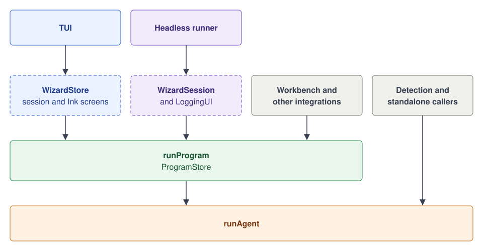

# Developer interfaces

There are four ways to run the wizard. Most end users run it from the TUI. The
headless runner runs the same flow without a terminal UI. `runProgram` runs just
one program, and `runAgent` runs only the agent.

| Way          | Entry                                                                                                     | Use it for                                            | Reference                                                                    |
| ------------ | --------------------------------------------------------------------------------------------------------- | ----------------------------------------------------- | ---------------------------------------------------------------------------- |
| TUI          | `npx @posthog/wizard`, through [`run-wizard.ts`](../src/lib/runners/run-wizard.ts)                        | End users setting up PostHog in a terminal            | [README](../README.md)                                                       |
| Headless     | `npx @posthog/wizard --ci`, through [`run-non-interactive.ts`](../src/lib/runners/run-non-interactive.ts) | CI and scripts, with no prompts                       | [Local credentials](local-dev.md#credentials-for-local-ci-and-headless-runs) |
| `runProgram` | `runProgram(programId, input, options)` from `@programs`                                                  | One program, from code, with its policy and telemetry | [`runProgram`](#runprogram), [programs reference](../src/programs/README.md) |
| `runAgent`   | `runAgent(config, input, options)` from `@agent`                                                          | Only the agent, from a resolved config                | [`runAgent`](#runagent), [agent reference](../src/agent/README.md)           |



The dashed boxes are the state the TUI and the headless runner keep above
`runProgram`. The workbench and other integrations call `runProgram` directly.

`runProgram` and `runAgent` live in this repository and import through its path
aliases. The `@posthog/wizard` npm package publishes the CLI, not these
functions.

## `runProgram`

### What `runProgram` is for

`runProgram` is a clean interface between the TUI, which is the interface, and
the programmatic parts of what a wizard program does.

> ⚠️ **Temporary adapter.** The TUI and the headless runner reach `runProgram`
> through `runProgramAgent` in
> [`run-agent-legacy.ts`](../src/programs/run-agent-legacy.ts). This is a
> temporary adapter, and we will remove it in the full program.

Three things use it:

1. **The TUI and the headless runner.** Both call `runProgram` to run a full
   wizard program.
2. **Testing.** The test workbench calls `runProgram` directly, with no TUI,
   from the `wizard-program` service in
   [wizard-workbench](https://github.com/PostHog/wizard-workbench).
3. **Other integrations.** If you want to integrate with the wizard more
   directly, without everything on top, call `runProgram` yourself.

### Signatures

```ts
import { runProgram } from '@programs';
import type {
  ProgramInput,
  ProgramOptions,
  ProgramRunOutcome,
} from '@programs/types';

// The shape `@programs` exports.
export const signature: (
  programId: string,
  input: ProgramInput,
  options?: ProgramOptions,
) => Promise<ProgramRunOutcome> = runProgram;
```

- **`programId`** says which program runs.
- **`input`** says what to run and where: the program's run definition built
  from its `ProgramConfig`, the install directory and the login.
- **`options`** is how the caller plugs in: credentials, questions, progress,
  the approval and gate waits, flags and cancellation.

`runProgram` resolves to one `ProgramRunOutcome`.

### Field definitions

| Field                                                        | Type                | What it's for                                                                    |
| ------------------------------------------------------------ | ------------------- | -------------------------------------------------------------------------------- |
| `programId`                                                  | `string`            | Which program runs. It names analytics, the route and the gateway spend.         |
| [`input`](../src/programs/run-program.ts#L66)                | `ProgramInput`      | What to run and where. `installDir` and `run` are required.                      |
| [`input.program`](../src/programs/run-program.ts#L56)        | `ProgramSettings`   | The program's settings from its `ProgramConfig`.                                 |
| [`options`](../src/programs/run-program.ts#L89)              | `ProgramOptions`    | The login, questions, approval and gate waits, flags, progress and cancellation. |
| [`options.onProgress`](../src/programs/program-store.ts#L21) | `ProgramProgress`   | Agent events and program data snapshots. Never awaited.                          |
| [Outcome](../src/programs/run-program.ts#L106)               | `ProgramRunOutcome` | How the run ended, the agent's result, the final data and the report path.       |

### Example

This runs the `metrics` program with a login you already hold. It asks your own
consent flow for approval, and logs what the program is doing:

```ts
import { RunOutcome } from '@agent';
import { getProgramConfig, runProgram } from '@programs';
import type {
  ProgramInput,
  ProgramOptions,
  ProgramProgress,
} from '@programs/types';

type Login = NonNullable<ProgramInput['credentials']>;
type AskForApproval = NonNullable<ProgramOptions['awaitAiApproval']>;

// Log what the program is doing. runProgram never waits for this.
function logProgress(progress: ProgramProgress): void {
  // Program data changed, for example the route resolved.
  if (progress.kind === 'program') {
    const route = progress.data.binding;
    if (route) console.log(`route: ${route.sequence} on ${route.harness}`);
    return;
  }
  // Otherwise it's one agent event.
  const { event } = progress;
  switch (event.kind) {
    case 'status':
      console.log(event.message);
      break;
    case 'tasks': {
      const done = event.tasks.filter((task) => task.status === 'completed');
      console.log(`tasks: ${done.length}/${event.tasks.length} done`);
      break;
    }
    case 'url':
      console.log(`${event.which}: ${event.url}`);
      break;
  }
}

export async function runMetrics(
  installDir: string,
  login: Login,
  askForApproval: AskForApproval,
  signal?: AbortSignal,
): Promise<string | undefined> {
  // Build the run from the program's own config.
  const config = getProgramConfig('metrics');
  if (!config.run || typeof config.run === 'function') {
    throw new Error('metrics has a static run definition');
  }

  const result = await runProgram(
    config.id,
    {
      installDir, // the project to change
      run: config.run,
      credentials: login, // skip the login step
      program: {
        requiresAi: config.requiresAi,
        agentFlow: config.agentFlow,
        allowedTools: config.allowedTools,
        disallowedTools: config.disallowedTools,
        excludedTaskTypes: config.excludedTaskTypes,
      },
    },
    {
      awaitAiApproval: askForApproval, // your consent flow
      onProgress: logProgress,
      signal, // abort to cancel; the run resolves to aborted
    },
  );

  // Endings resolve to an outcome. Check it instead of catching.
  if (result.outcome !== RunOutcome.Success) {
    throw result.failure?.error ?? new Error(result.failure?.message);
  }
  return result.artifacts.reportFile; // where the agent wrote its report
}
```

### Cancellation

Pass a `signal` to cancel the run. The credentials, approval and gate waits
receive it, and each must settle when it aborts. A cancelled run resolves to
`aborted`, not a rejection.

### Failures

Most endings resolve to an outcome instead of throwing. Check `outcome` and read
`failure`. The promise rejects only when the call itself can't run, such as an
input field that can't be copied. The cases are in
[`run-program.ts`](../src/programs/run-program.ts#L163).

### Program callbacks

A program's `run` and `ciPreRun` receive a runner context, `RunnerContext` or
`CiRunnerContext`, instead of calling `getUI()`. Both types come from
`@programs/types` and are defined in
[`runner-context.ts`](../src/programs/runner-context.ts). Build it when you
build the run from a `ProgramConfig`, before you call `runProgram`.

## `runAgent`

### What `runAgent` is for

`runAgent` runs only the agent. Call it when you have a resolved route and no
program policy to apply. It doesn't log in, ask for consent, load flags or
resolve a route. The caller does those.

### Signatures

```ts
import { runAgent } from '@agent';
import type {
  AgentInteraction,
  AgentProgress,
  RunConfig,
  RunInput,
  RunResult,
} from '@agent/types';

// The shape `@agent` exports.
export const signature: (
  config: RunConfig,
  input: RunInput,
  options?: {
    onProgress?: (event: AgentProgress) => unknown;
    interaction?: AgentInteraction;
    signal?: AbortSignal;
  },
) => Promise<RunResult> = runAgent;
```

- **`config`** says what the agent runs: the run definition, the route and the
  tools.
- **`input`** says where and as whom: the project, the login and the flags.
- **`options`** carries progress, questions and cancellation.

`runAgent` resolves to one `RunResult`. It mints its own gateway token from
`input.credentials`.

### Field definitions

| Field                                                   | Type                 | What it's for                                                                   |
| ------------------------------------------------------- | -------------------- | ------------------------------------------------------------------------------- |
| [`config`](../src/agent/runner/shared/types.ts#L151)    | `RunConfig`          | What the agent runs, with its route and tools.                                  |
| [`config.run`](../src/agent/runner/shared/types.ts#L48) | `AgentRunDefinition` | The prompt and run options, such as `collectTranscript`.                        |
| [`input`](../src/agent/runner/shared/types.ts#L205)     | `RunInput`           | Where and as whom: the project, the login and the flags.                        |
| `options`                                               |                      | `onProgress` for agent events, `interaction` for questions, `signal` to cancel. |
| [Result](../src/agent/runner/shared/types.ts#L307)      | `RunResult`          | How the run ended, with a snapshot of its tasks and transcript.                 |

### Callers

| Caller                                                                            | What it runs                                    |
| --------------------------------------------------------------------------------- | ----------------------------------------------- |
| `runProgram`                                                                      | One program's agent run.                        |
| `detectProjectsWithAgent` in [`agentic.ts`](../src/programs/detection/agentic.ts) | The agentic project scan, one call per attempt. |
| [`a3-fault-probe.no-jest.ts`](../scripts/a3-fault-probe.no-jest.ts)               | A fault probe against a local gateway.          |

### Example

This lists a project's files with a read-only agent and returns what it said:

```ts
import { runAgent, RunOutcome } from '@agent';
import type { RunConfig, RunInput } from '@agent/types';
import {
  getSkillsBaseUrl,
  Harness,
  HAIKU_MODEL,
  Sequence,
} from '@shared/constants';

export async function listProjectFiles(
  programId: string,
  input: RunInput, // the project, the login and the flags
  signal?: AbortSignal,
): Promise<string> {
  const config: RunConfig = {
    programId, // attributes the gateway spend
    run: {
      integrationLabel: 'list-files',
      prompt: () => 'List the files in the working directory. Change nothing.',
      collectTranscript: true, // keep the agent's output to return below
      requestRemark: false, // no closing remark
      spinnerMessage: 'Listing files...',
      successMessage: 'Listed files',
      estimatedDurationMinutes: 1,
      reportFile: '',
      docsUrl: 'https://posthog.com/docs',
    },
    composed: true, // a sub-run: the caller owns the outro
    // You pick the route yourself. runAgent doesn't resolve one.
    binding: {
      sequence: Sequence.linear,
      harness: Harness.anthropic,
      model: HAIKU_MODEL,
    },
    switchboard: { program: programId, composed: true, flags: {} },
    skillsBaseUrl: getSkillsBaseUrl(),
    wizardFlags: {},
    wizardFlagPayloads: {},
    wizardMetadata: {},
    allowedTools: ['Read', 'Glob'], // read-only
  };

  const result = await runAgent(config, input, {
    signal,
    // Each step the agent takes, as one line.
    onProgress: (event) => {
      if (event.kind === 'activity') console.log(event.line);
    },
  });
  if (result.outcome !== RunOutcome.Success) {
    throw result.failure.error ?? new Error(result.failure.message);
  }
  return result.snapshot.transcriptTail ?? '';
}
```

`collectTranscript` and `requestRemark` take effect on the linear sequence with
the Anthropic harness.
