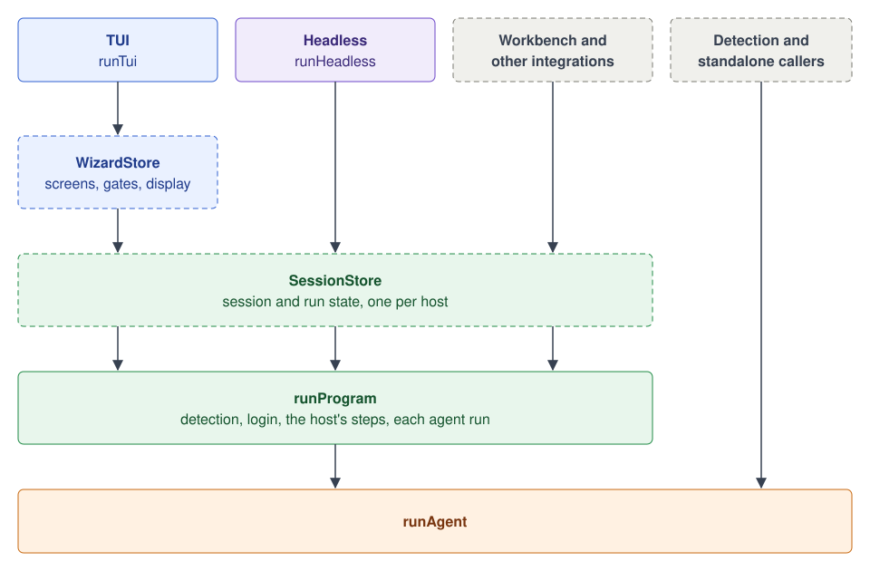

# Developer interfaces

There are four ways to run the wizard. Most end users run it from the TUI. The
headless host runs the same programs without a terminal UI. Published builds
reject `--ci`, so a headless run needs a checkout or a `build:ci` build.
`runProgram` runs one program on a session store you own, and `runAgent` runs
only the agent.

| Way          | Entry                                                                                                     | Use it for                                            | Reference                                                                    |
| ------------ | --------------------------------------------------------------------------------------------------------- | ----------------------------------------------------- | ---------------------------------------------------------------------------- |
| TUI          | `npx @posthog/wizard`, through [`runTui`](../src/tui/run.ts)                                              | End users setting up PostHog in a terminal            | [README](../README.md#what-calls-what)                                       |
| Headless     | `pnpm try --ci` in a checkout, through [`runHeadless`](../src/headless/run.ts)                            | CI and scripts, with no screens                       | [Local credentials](local-dev.md#credentials-for-local-ci-and-headless-runs) |
| `runProgram` | `runProgram(programId, input, options)` from `@programs`                                                  | One program, from code, with its policy and telemetry | [`runProgram`](#runprogram), [programs reference](../src/programs/README.md) |
| `runAgent`   | `runAgent(config, input, options)` from `@agent`                                                          | Only the agent, from a resolved config                | [`runAgent`](#runagent), [agent reference](../src/agent/README.md)           |



The CLI starts one of the two hosts. Each builds its own `SessionStore` and
calls `runProgram` with it; the TUI draws its screens from the `WizardStore` on
top. The workbench and other integrations build a store and call `runProgram`
directly. Detection calls `runAgent` itself, and so does your own code. Dashed
boxes are state, and callers that build against a checkout of this repository.

A tool's command, such as `mcp add` or `doctor`, runs no program and no agent
run. The CLI calls the TUI's `runTuiTool` for its screens, or a console runner
from `@tools`. See [src/tools](../src/tools/README.md).

`runProgram` and `runAgent` live in this repository and import through its path
aliases. The `@posthog/wizard` npm package publishes the CLI, not these
functions.

## `runProgram`

### What `runProgram` is for

`runProgram` is the one way a program runs. It separates what a host shows from
what a wizard program does: detection, readiness, the login, the approval, and
each agent run the program composes.

Three things use it:

1. **The TUI and headless hosts.** Each calls `runProgram` with its own session
   store: the TUI with its OAuth login, its WizardAsk screen as the answerer and
   its screens as the workflow; headless with an API-key login and no workflow.
2. **Testing.** The test workbench calls `runProgram` directly, with no TUI,
   from the `wizard-program` service in
   [wizard-workbench](https://github.com/PostHog/wizard-workbench).
3. **Other integrations.** If you want to integrate with the wizard more
   directly, without everything on top, build a store and call `runProgram`.

### Signatures

```ts
import { runProgram } from '@programs';
import type {
  ProgramInput,
  ProgramOptions,
  ProgramRunOutcome,
} from '@programs/types';

// The shape `@programs` exports.
export const signature: (
  programId: string,
  input: ProgramInput,
  options?: ProgramOptions,
) => Promise<ProgramRunOutcome> = runProgram;
```

- **`programId`** says which registered program runs.
- **`input`** says what it runs on: the session store you own, an optional
  overlay on its registered `ProgramConfig`, and optionally a login you already
  hold and a flag snapshot.
- **`options`** is how the caller plugs in: credentials, questions, progress,
  the workflow that answers the run's steps, flags and cancellation.

`runProgram` resolves to one `ProgramRunOutcome`, and the run is in the store.

### Field definitions

| Field                                                        | Type                | What it's for                                                                    |
| ------------------------------------------------------------ | ------------------- | -------------------------------------------------------------------------------- |
| `programId`                                                  | `string`            | Which registered program runs. It names analytics, the route and the gateway spend. |
| [`input`](../src/programs/program-input.ts) | `ProgramInput` | What the program runs on. Only `store` is required. |
| [`input.store`](../src/programs/session/session-store.ts) | `SessionStore` | Launch values, detection and run state. `new SessionStore(buildSession({ installDir }))` builds one. |
| `input.config` | `Partial<ProgramConfig>` | Laid over the registered config, such as a one-off `run`. |
| `input.credentials` | `ResolvedProgramCredentials` | A login you already hold. Without it the run uses the store's login, then `options.credentials`. |
| `input.wizardFlags`, `input.wizardFlagPayloads` | `Record` | A flag snapshot. Without `wizardFlags` the run calls `options.featureFlags`, if you pass it. |
| `input.runId` | `string` | Labels the program's own agent run in progress events. Generated when absent. |
| `input.composed` | `boolean` | A run inside another's: its caller writes the outro. `runProgram` still settles the phase. |
| [`options`](../src/programs/program-input.ts)                | `ProgramOptions`    | The login, the answerer, the workflow, flags, progress and cancellation.         |
| `options.credentials` | `CredentialsProvider` | Resolves the login when neither `input` nor the store has one. |
| `options.interaction` | `AgentInteraction` | Answers the agent's questions and notices. Absent, the agent asks nothing. |
| `options.workflow` | `ProgramWorkflowConnector` | Answers each [step](#the-steps-a-run-waits-on) with a yes or no. Absent, each step takes its default. |
| `options.onProgress` | `(ProgramProgress) => void` | Every agent event with its `runId` and, for a composed run, its `stepId`. Never awaited. |
| `options.featureFlags` | `() => Promise<WizardFlagSnapshot>` | Loads the flags when `input` has none. |
| `options.signal` | `AbortSignal` | Cancels the run. |
| [Outcome](../src/programs/program-input.ts) | `ProgramRunOutcome` | How the run ended, each agent run's result in order, the report path, any failure and any observer diagnostics. |

The store holds PostHog tokens, including the refresh token, once the run logs
in. Don't log or serialize its credentials.

A `ci` or `signup` session skips the AI-processing approval. Set them only
when consent is already settled.

### The session store

You own the store. Build it from launch values with `buildSession`, then read it
while the run goes and after it ends: `runProgram` records detection, the login,
the readiness result, the run's status, tasks, links, handoff and outro, and on
a failure the error outro and its code. A host subscribes to it; the TUI renders
from it and headless streams it. A store that already holds a login is reused,
so a second run in the same store doesn't log in again, and one that already ran
detection (`detectionComplete`) skips it.

When `runProgram` settles, the store's `runPhase` is `completed` or `error`. A
`composed` run leaves the outro to its caller. A run where no agent ran, such as
one whose only run step the workflow declined, leaves the phase as it was.

### The steps a run waits on

`runProgram` asks `options.workflow.confirmStep(step, { signal })` at each point
that needs a decision, and continues on `true`:

| `step.kind`         | When                                                                  | With no workflow                    |
| ------------------- | --------------------------------------------------------------------- | ----------------------------------- |
| `ai-approval`       | The organization hasn't approved AI data processing                   | The run fails                       |
| `service-outage`    | A service the run needs is down; `step.readiness` says which          | The run goes on and logs the outage |
| `settings-conflict` | A Claude settings file redirects the agent; `step.fix()` removes it   | The run fails closed                |
| `run`               | Before each agent run: a composed sub-run from `runSteps`, then `run` | Only the program's own run runs     |

`finishStep(step, result)` reports each agent run step once it settles. The TUI
answers a `run` step once the flow reaches it, so the screens before it settle
first.

### Do a quack

[`run-program-quack.ts`](examples/run-program-quack.ts) is the smallest
`runProgram` call. It builds a store, runs one prompt that replies `quack`, logs
status lines and prints the outcome. Each step has a comment.

Run it from the repository root against the [local stack](local-dev.md):

```bash
npx tsx --tsconfig tsconfig.json docs/examples/run-program-quack.ts
```

It prints `reply: quack` and `outcome: success`. A failed run also prints
`failure:` with its message.

### Cancellation

Pass a `signal` to cancel the run. The credentials provider and the workflow's
steps receive it, and each should stop when it aborts: the run doesn't wait for
them once it does. A cancelled run resolves to `aborted`, not a rejection.

### Failures

Most endings resolve to an outcome instead of throwing. Check `outcome` and read
`failure`; the store holds the same failure as its error outro. A cancel through
`signal` is the exception: the store holds a cancel outro with no error code,
and the phase is still error. The promise rejects only when the call itself
can't run, such as an input field that can't be copied, or when resolving the
program's `run` or an agent run throws something other than a `ProgramAbort`. A
detection throw resolves to `crashed` with the error attached. A rejection
records its error outro and code in the store first. The cases are in
[`run-program.ts`](../src/programs/run-program.ts).

### Runs in one process

`runProgram` calls in one process may follow each other but may not overlap. The
process holds one OAuth login session (`@shared/oauth-session`): a refresh token
works once, so every holder of a login shares one rotation. Each run adopts its
own login and its own gateway token, so a later run never uses an earlier one's.

### Program callbacks

Programs never use the UI. A program's `run` and `ciPreRun` receive a runner
context instead. Both types come from `@programs/types` and are defined in
[`runner-context.ts`](../src/programs/runner-context.ts). `runProgram` runs a CI
session's `ciPreRun`, or any other session's `onReady`, as its detection. It
calls `run` with a runner over the store: framework-context reads and writes go
to the store, and log lines and the spinner arrive as the run's progress.

| Context           | Passed to  | Fields                                                                                                                        |
| ----------------- | ---------- | ----------------------------------------------------------------------------------------------------------------------------- |
| `RunnerContext`   | `run`      | `getFrameworkContext(key)`, `setFrameworkContext(key, value)`, `log.info`, `log.warn` and `spinner()`.                        |
| `CiRunnerContext` | `ciPreRun` | `log.info`, `log.warn`, `authenticate(programId)`, which logs in once, and an optional `onProgress(event)` for scan progress. |

Both read the session as a `ProgramSession`, defined in
[`program-session.ts`](../src/programs/program-session.ts). A `run` or
`ciPreRun` that writes to the session it is handed writes to a copy, and
`runProgram` stores what it changed.

A run step's `onRunPrep` runs once the workflow confirms that step, on the run's
own copy of the session, and receives the runner's `log`.

## `runAgent`

### What `runAgent` is for

`runAgent` runs only the agent. Call it when you have no program policy to
apply. It doesn't log in, ask for consent or load flags; the caller does those.
It resolves the route from `config.routing`: the launch overrides, then the
flags, then the program's binding.

### Signatures

```ts
import { runAgent } from '@agent';
import type {
  AgentInteraction,
  AgentProgress,
  RunConfig,
  RunInput,
  RunResult,
} from '@agent/types';

// The shape `@agent` exports.
export const signature: (
  config: RunConfig,
  input: RunInput,
  options?: {
    onProgress?: (event: AgentProgress) => unknown;
    interaction?: AgentInteraction;
    signal?: AbortSignal;
  },
) => Promise<RunResult> = runAgent;
```

- **`config`** says what the agent runs: the run definition, the routing and the
  tools.
- **`input`** says where and as whom: the project, the login and the flags.
- **`options`** carries progress, questions and cancellation.

`runAgent` resolves to one `RunResult` and never rejects: `outcome` is
`success`, `aborted`, `failed` or `crashed`, and a non-success carries
`failure`. It mints its own gateway token from `input.credentials`, or uses the
pre-issued one in `input.credentials.gateway`, as the quack example does.

### Field definitions

| Field                                                                | Type                 | What it's for                                                                   |
| -------------------------------------------------------------------- | -------------------- | ------------------------------------------------------------------------------- |
| [`config`](../src/agent/runner/shared/types.ts)                      | `RunConfig`          | What the agent runs, with its routing and tools.                                |
| `config.programId` | `string` | Names the gateway spend and the analytics label. The agent treats it as opaque. |
| `config.run`                                                         | `AgentRunDefinition` | The prompt and run options, such as `collectTranscript`, `readOnly`, and `structured`, a JSON schema and deadline for a typed result. |
| `config.composed` | `boolean` | A run inside another's leaves the terminal outro to its caller. |
| `config.routing` | `AgentRouting` | The program's binding (`DEFAULT_BINDING` from `@agent` when it has none), the launch overrides, and `scan` for a project scan's triage route. |
| `config.skillsBaseUrl` | `string` | The skills origin, from `getSkillsBaseUrl()`. |
| `config.wizardFlags`, `config.wizardFlagPayloads` | `Record` | The flag snapshot the caller evaluated. Empty when there are no flags. |
| `config.allowedTools`                                                | `readonly string[]`  | Tools added to the base tools.                                                  |
| `config.disallowedTools`                                             | `readonly string[]`  | Tools removed from the base tools.                                              |
| `config.hooks` | `RunHooks` | The caller's completion hooks: `postRun`, the outro builders and `recordTaskOutcomes`. |
| [`input`](../src/agent/runner/shared/types.ts) | `RunInput` | Where and as whom: `installDir`, `credentials`, `project`, `apiUser`, `flags` and `host`. |
| `options.onProgress` | `(AgentProgress) => unknown` | Every progress event in order. Never awaited. A throwing observer is logged and the run goes on. |
| `options.interaction` | `AgentInteraction` | Answers the agent's questions and notices. Absent, the agent has no ask bridge and declines notices. |
| `options.signal` | `AbortSignal` | Cancels the run. |
| [Result](../src/agent/runner/shared/types.ts) | `RunResult` | `outcome`, a `failure` on any non-success, a snapshot of the run's tasks and transcript, and the `structuredOutput` of a typed run. |

### Callers

| Caller                                                                            | What it runs                                    |
| --------------------------------------------------------------------------------- | ----------------------------------------------- |
| `runProgram`                                                                      | One program's agent run.                        |
| `detectProjectsWithAgent` in [`agentic.ts`](../src/programs/detection/agentic.ts) | The agentic project scan, one typed, read-only call per attempt. |
| [`a3-fault-probe.no-jest.ts`](../scripts/a3-fault-probe.no-jest.ts)               | A fault probe against a local gateway.          |

### Do a quack

[`run-agent-quack.ts`](examples/run-agent-quack.ts) is the smallest `runAgent`
call. It builds a `RunConfig` with one prompt and no Write, Edit or Bash, and
prints the transcript tail and the outcome. It logs in with
`resolveApiKeyProject` from `@shared/api-key-login`, and imports nothing from
`@programs`. Each step has a comment.

```bash
npx tsx --tsconfig tsconfig.json docs/examples/run-agent-quack.ts
```

It prints `transcriptTail: quack` and `outcome: success`.

## Hosts

The CLI and scripts (such as `scripts/tui-host.no-jest.ts`, which the e2e
harness spawns) start a host through the entry of its layer. Each entry function
loads its host on first call and resolves an exit code. A host never exits the
process: the caller applies the code, as the CLI does with `exitWith`.

| Call                          | Entry       | Runs                                  |
| ----------------------------- | ----------- | ------------------------------------- |
| `runTui(config, launch)`      | `@tui`      | One program in the TUI                |
| `runHeadless(config, launch)` | `@headless` | One program with no screens           |
| `runTuiTool(toolId, launch)`  | `@tui`      | A tool's screens, with no program run |

A launch is plain data. Every launch needs `session`, the launch values, and
`signal`, the CLI's abort signal. A `HeadlessLaunch` also needs `mode`. The rest
is optional.

| Field           | In                            | What it's for                                                                                                |
| --------------- | ----------------------------- | ------------------------------------------------------------------------------------------------------------ |
| `session`       | All three                     | The launch values, as `SessionArgs`. A TUI launch adds the TUI's own choices, `integrate` and `mcpFeatures`. |
| `signal`        | All three                     | The CLI aborts it on SIGINT, SIGTERM or SIGHUP, with the signal name as the reason.                          |
| `mode`          | `HeadlessLaunch`              | `ci` dumps the task stream to a local file, and `headless` streams it to PostHog.                            |
| `credentials`   | `TuiLaunch`                   | The login for the run. The browser OAuth login when absent.                                                  |
| `skillId`       | `TuiLaunch`                   | The skill to run, from `--skill` or `wizard skill <id>`. Else the program's own.                             |
| `taskStreamLog` | `TuiLaunch`, `HeadlessLaunch` | The task-stream dump path, or an empty string for the default one.                                           |
| `runId`         | `TuiLaunch`, `HeadlessLaunch` | The cloud WizardRun the run reports under.                                                                   |
| `onStore`       | `TuiLaunch`                   | The store once it exists, for the in-process e2e host.                                                       |

A host resolves 0 when the run succeeds and 1 when a decided failure ends it,
unless the failure names another code. `runTuiTool` resolves the code a screen
requests. Every host resolves 130 on SIGINT or SIGHUP and 143 on SIGTERM. Only
the CLI and `bin.ts` call `process.exit`.
