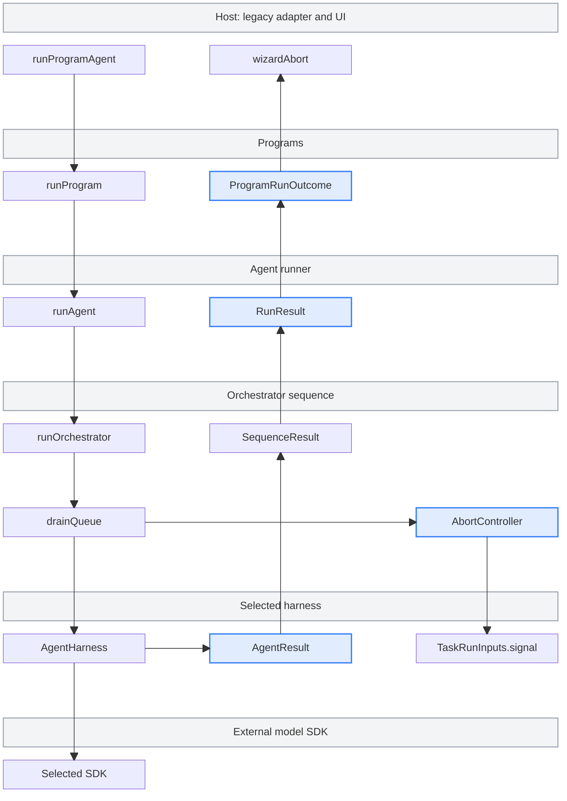

# agent runner

How an agent run is assembled. Everything under this directory is plumbing: the
pieces that decide _how_ a program runs (which query shape, which agent SDK,
which model) and the pieces that then actually run it.

```
  ┌──────────────┐     ┌─────────────┐     ┌────────────────────────────┐
  │              │     │             │────▶│ sequence   (query shape)   │
  │  programs    │────▶│ switchboard │     │   linear | orchestrator    │
  │              │     │             │     └────────────────────────────┘
  │  integration │     │  binds each │
  │  audit       │     │  program to │     ┌────────────────────────────┐
  │  migration   │     │  a pair     │────▶│ harness    (SDK adapter)   │
  │  ...         │     │             │     │   anthropic | pi | ...     │
  └──────────────┘     └─────────────┘     └────────────────────────────┘
```

## Execution policy

Use Pi for new work and prefer the orchestrator sequence. Linear execution is
retained for very simple tasks and legacy support. The Anthropic Agent SDK is a
supported legacy fallback, deprecated as the default, retained for major Pi
vulnerabilities or gaps in support for new Anthropic models.

Existing `DEFAULT_BINDING` is Pi + linear. Explicit program bindings and flags
determine actual behavior. Both harnesses implement `run` and `runTask`.
Composed sub-runs are clamped to linear, and linear-only post-run/outro hooks do
not automatically transfer to an orchestrated flow.

New models require Wizard capabilities **and** mint model/effort allowlists,
gateway provider/transport support, and compatibility with required Wizard and
security-triage prompt policies. Local model constants cannot bypass admission.
See the
[development guide](../../../.claude/skills/wizard-development/SKILL.md#execution-policy-and-model-admission)
for the coordinated change checklist.

## The pieces

Five layers, each with its own job. Nothing crosses layers unless it has to.

**The entry point** (`index.ts`) is the front door:
`runAgent(config, input, {onProgress?, interaction?, signal?}) → RunResult`. It
takes resolved execution data and an invocation snapshot (`shared/types.ts`),
reports through `onProgress` and asks through `interaction` (`../progress.ts`),
and returns every ending as a result. It never renders, reads a session or
exits. The caller resolves credentials, consent, flags and the route first. For
programs, `runProgram` in `src/programs/run-program.ts` does that, and the
legacy adapter in `src/programs/run-agent-legacy.ts` runs the readiness and
settings gates and maps progress back onto `getUI()`.

The entry point also owns two per-run switches. When `config.run` sets
`collectTranscript`, it creates the transcript tail and passes it to the
sequence. After the sequence returns, it adds the tail to
`snapshot.transcriptTail`. When `config.scanReport` is `'defer'`, it skips the
end-of-run scan report flush. See
[transcript tail](../README.md#transcript-tail) and
[scan report](../README.md#scan-report).

**Prepare** (`shared/bootstrap.ts`) is the on-ramp inside the agent: logging
targets, the gateway mint and the scan-triage classifier. Whether the run turns
out to be linear or orchestrator, anthropic or pi, the setup is the same.

**The switchboard** (`switchboard/`) is the router. Given a program id + the
fetched flags + any CLI overrides, it returns a `ProgramBinding`: which query
shape (sequence), which agent SDK (harness), which model. Two independent
middleware chains, one per axis, apply precedence rules (CLI > flag > program
config > default). This is the only layer that makes routing decisions.

**Sequences** (`sequence/`) are LLM query shapes. Once the switchboard has
picked one, that sequence takes over the run and owns _how the LLM's work is
shaped_. See `sequence/README.md`.

- **linear**: one long conversation with the model, start to finish. It builds
  the prompt from `run.prompt` when set, else from the project prompt plus
  `run.customPrompt`. It puts the transcript tail in front of the benchmark
  middleware.
- **orchestrator**: many focused conversations coordinated by a task queue, each
  with its own prompt, tools, and model.

**Harnesses** (`harness/`) are SDK adapters. Sequences don't call Anthropic's or
pi.dev's SDKs directly. They go through a harness, which knows how to translate
a run request into that SDK's shape. All harnesses drive the PostHog LLM
gateway.

- **anthropic**: wraps Anthropic's official Claude Agent SDK. See
  `harness/anthropic/README.md`. Its linear run feeds every SDK message to the
  middleware, so the transcript tail and its `activity` events come from here.
  It passes `run.requestRemark` to the stop hook.
- **pi**: wraps pi.dev's coding-agent library. See `harness/pi/README.md`. Its
  linear run always asks for the remark and takes no middleware.

The orchestrator asks neither harness for a remark on its tasks.

## How they connect

- Prepare mints the gateway token and builds triage for the resolved harness.
- The switchboard knows which sequences and harnesses exist (via its two
  registries), but not what they do.
- A sequence knows how to shape a conversation, but delegates the actual model
  call to a harness.
- A harness adapts its SDK, gateway transport, security hooks, and tool surface.

Each layer is replaceable.

## Ownership map



Calls descend on the left, results return through the middle, and cancellation
moves down the right. Blue marks the result contracts and run-scoped abort. On
the first fatal task result, `drainQueue` stops scheduling, cancels active work
and pending asks, joins siblings, then preserves that failure for the host to
present.

## Flow

1. The caller resolves credentials, consent, flags and a
   `ProgramBinding { sequence, harness, model }`, and analytics tags the run.
   For programs, `runProgram` does this.
2. `runAgent(config, input, options)` creates the transcript tail when the run
   collects one, then prepares (mint, triage).
3. Sequence takes over. It shapes the LLM's work into one conversation (linear)
   or many (orchestrator), reporting through `onProgress`.
4. Harness drives each conversation through its SDK, using the bound model, on
   the PostHog LLM gateway.
5. The scan report flushes, unless `config.scanReport` is `'defer'`. `runAgent`
   returns a `RunResult` whose snapshot carries the transcript tail when the run
   collected one.
6. The caller applies it. `runProgram` settles it into a `ProgramRunOutcome`.
   The legacy adapter sends a decided failure to `wizardAbort` with the terminal
   status its outcome names, rethrows a crash for the runner's own handling, and
   sends the terminal success analytics for a non-composed success. The agent
   sends no terminal analytics.

## Who calls `runAgent`

- `runProgram`, for every program's agent run.
- Agentic detection, in `src/programs/detection/agentic.ts`. Each attempt is a
  linear Haiku run on the Anthropic harness with its own deadline signal. It
  sets `run.prompt`, `collectTranscript: true`, `requestRemark: false` and
  `scanReport: 'defer'`, and reads its report from `snapshot.transcriptTail`.
- The fault probe in `scripts/a3-fault-probe.no-jest.ts`, and any standalone
  host. See the
  [developer interfaces](../../../docs/developer-interfaces.md#runagent-for-detection-and-standalone-callers).
