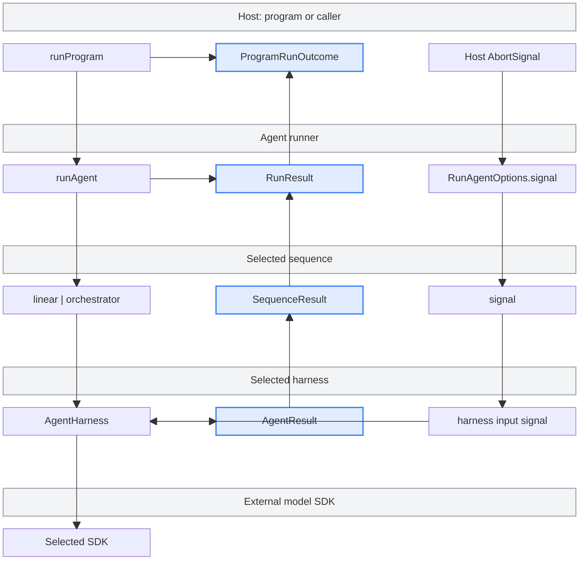

# agent runner

How an agent run is assembled. Everything under this directory is plumbing — the
pieces that decide _how_ a program runs (which query shape, which agent SDK,
which model) and the pieces that then actually run it.

```
  ┌──────────────┐     ┌─────────────┐     ┌────────────────────────────┐
  │              │     │             │────▶│ sequence   (query shape)   │
  │  programs    │────▶│ binding     │     │   linear | orchestrator    │
  │              │     │             │     └────────────────────────────┘
  │  integration │     │ selects the │
  │  audit       │     │ sequence,   │     ┌────────────────────────────┐
  │  migration   │     │ harness and │────▶│ harness    (SDK adapter)   │
  │  ...         │     │ model       │     │   anthropic | pi | ...     │
  └──────────────┘     └─────────────┘     └────────────────────────────┘
```

## Execution policy

Use Pi for new work and prefer the orchestrator sequence. Linear execution is
retained for very simple tasks and legacy support. The Anthropic Agent SDK is a
supported legacy fallback, deprecated as the default, retained for major Pi
vulnerabilities or gaps in support for new Anthropic models.

Existing `DEFAULT_BINDING` remains Anthropic + linear; explicit program bindings
and flags determine actual behavior. Both harnesses implement `run` and
`runTask`. Composed sub-runs are clamped to linear, and linear-only
post-run/outro hooks do not automatically transfer to an orchestrated flow.

New models require Wizard capabilities **and** mint model/effort allowlists,
gateway provider/transport support, and compatibility with required Wizard and
security-triage prompt policies. Local model constants cannot bypass admission.
See the
[development guide](../../../.claude/skills/wizard-development/SKILL.md#execution-policy-and-model-admission)
for the coordinated change checklist.

## The pieces

Five layers, each with its own job. Nothing crosses layers unless it has to.

**The entry point** (`index.ts`) is the front door:
`runAgent(config, input, {onProgress?, interaction?, signal?}) → RunResult`. It
takes resolved execution data and an invocation snapshot (`shared/types.ts`),
reports through `onProgress` and asks through `interaction` (`../progress/progress.ts`),
and returns decided outcomes and caught run-body crashes as results. It never
renders, reads a session or exits. `src/programs/run/run-program.ts` resolves the
binding from caller data. The legacy `src/cli/runners/run-program-agent.ts` owns
session gates and maps progress back onto `getUI()`.

**Prepare** (`shared/bootstrap.ts`) is the on-ramp inside the agent: logging
targets, caller-supplied inference auth and the scan-triage classifier. Whether
the run turns out to be linear or orchestrator, anthropic or pi, the setup is
the same.

**The switchboard** (`switchboard/`) contains the sequence, harness and model
resolution helpers. The program layer turns its program ID, validated flag route
and CLI overrides into a resolved binding before calling `runAgent`. Agent code
uses that binding to select a sequence and harness; it does not read the program
registry or parse feature flags.

**Sequences** (`sequence/`) are LLM query shapes. Once the switchboard has
picked one, that sequence takes over the run and owns _how the LLM's work is
shaped_. See `sequence/README.md`.

- **linear** — one long conversation with the model, start to finish.
- **orchestrator** — many focused conversations coordinated by a task queue,
  each with its own prompt, tools, and model.

**Harnesses** (`harness/`) are SDK adapters. Sequences don't call Anthropic's or
pi.dev's SDKs directly — they go through a harness, which knows how to translate
a run request into that SDK's shape. All harnesses drive the PostHog LLM
gateway.

- **anthropic** — wraps Anthropic's official Claude Agent SDK. See
  `harness/anthropic/README.md`.
- **pi** — wraps pi.dev's coding-agent library. See `harness/pi/README.md`.

## How they connect

- Programs supply inference auth; prepare resolves it and builds triage for the
  resolved harness.
- The program layer resolves the binding with the switchboard helpers. Agent
  code dispatches the selected sequence and harness.
- A sequence knows how to shape a conversation, but delegates the actual model
  call to a harness.
- A harness adapts its SDK, gateway transport, security hooks, and tool surface.

Each layer is replaceable.

## Ownership map



Calls descend on the left, results return through the middle, and a host-owned
abort signal descends on the right. A standalone caller invokes `runAgent`
without `runProgram`. A program may return a pre-run failure without starting
the agent, and a caught preparation error produces `RunResult` without a
`SequenceResult`. The orchestrator stops scheduling on the first fatal task
result, cancels active siblings and pending asks, and waits for them to settle
before returning that failure. A host signal can also cancel active harness
work.

## Flow

1. The caller runs its gates, authenticates, fetches PostHog flags and resolves
   a `ProgramBinding { sequence, harness, model }`; analytics tags the run.
2. `runAgent(config, input, options)` resolves the supplied inference auth and
   prepares triage.
3. Sequence takes over — shapes the LLM's work into one conversation (linear) or
   many (orchestrator), reporting through `onProgress`.
4. Harness drives each conversation through its SDK, using the bound model, on
   the PostHog LLM gateway.
5. The scan report flushes on a best-effort basis as the run ends. `runAgent`
   resolves a `RunResult` with an outcome and progress snapshot. A non-success
   result carries a code and message; a caught error remains attached.
6. The caller applies it. The legacy runner sends a decided failure to
   `wizardAbort`; for a crash it rethrows the attached `Error` when present.
   Other hosts can log, present, or rethrow the failure as they need.
