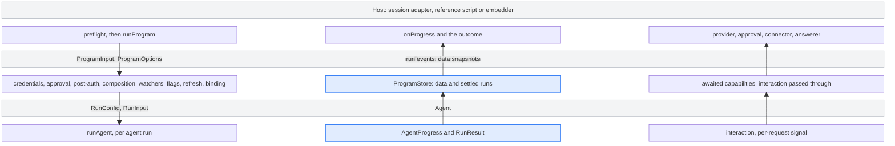

# Programs

`runProgram` runs a registered Wizard program from data the caller supplies. It
owns one invocation's state, resolves the run definition and binding, and passes
each agent run to [`runAgent`](../agent/README.md). Callers don't create a
`WizardSession` or a UI store. This is a repository-local TypeScript interface.
The npm package doesn't export it as a public library API.

## Signatures

Import runtime values from `@programs` and types from `@programs/types`:

```ts
import { preflight, runProgram } from '@programs';
import type {
  ProgramInput,
  ProgramOptions,
  ProgramPreflightDecision,
  ProgramPreflightHost,
  ProgramRunOutcome,
} from '@programs/types';

runProgram(
  programId: string,
  input: ProgramInput,
  options?: ProgramOptions,
): Promise<ProgramRunOutcome>

preflight(
  programId: string,
  host: ProgramPreflightHost,
): Promise<ProgramPreflightDecision>
```

`programId` must name a program in the runtime registry. An unknown ID returns a
failed outcome. The exact shapes are in [`run-program.ts`](run-program.ts),
[`program-store.ts`](program-store.ts) and [`preflight.ts`](preflight.ts).

### Exports

| Export                                                                                                                | What it's for                                                                                |
| --------------------------------------------------------------------------------------------------------------------- | -------------------------------------------------------------------------------------------- |
| `runProgram`                                                                                                          | Run one program invocation.                                                                  |
| `preflight`                                                                                                           | Run the readiness and settings checks before `runProgram`.                                   |
| `createPosthogInferenceAuthProvider`                                                                                  | Mint first-party gateway auth from a PostHog login, for a host that calls `runAgent` itself. |
| `PROGRAM_REGISTRY`, `Program`, `getProgramConfig`, `getSubcommandPrograms`, `getCommandPath`, `getLaunchablePrograms` | The step-based `ProgramConfig` registry that the TUI and the CLI commands use.               |

The type entry adds the input, option, outcome, progress, connector and
preflight types named below. It also carries the `ProgramConfig` step types, the
switchboard context type, and the `ProgramCiHost` and `ProgramRunHost`
capability types.

The entry doesn't re-export the policy that `runProgram` applies. Tests and
tools import it from its module:

- `PROGRAM_BINDINGS` and `resolveProgramBinding` from [`binding.ts`](binding.ts)
- `captureSwitchboardDecision` from
  [`binding-telemetry.ts`](binding-telemetry.ts)
- `getProgramCommandments` from [`commandments.ts`](commandments.ts)
- `resolveStageOverrides` and `areSeededTasksEnabled` from
  [`experiments/`](experiments/index.ts)

### Inputs

`ProgramInput` needs only `installDir`. Everything else is optional data for
this invocation.

| Field                                                                                           | What it carries                                                                                                                                                                              |
| ----------------------------------------------------------------------------------------------- | -------------------------------------------------------------------------------------------------------------------------------------------------------------------------------------------- |
| `installDir`                                                                                    | The project directory. Report paths resolve against it.                                                                                                                                      |
| `credentials`                                                                                   | Resolved `{ posthog, inferenceAuth?, project, apiUser }`. It wins over `options.credentials`. Without `inferenceAuth`, `runProgram` mints first-party gateway auth from the refreshed login. |
| `runId`                                                                                         | Stable attribution. Generated when absent. A composed child gets `<runId>:<stepId>` unless its own input sets one.                                                                           |
| `overrides`                                                                                     | `{ harness?, sequence?, model? }` from launch flags such as `--harness`, `--sequence` and `--model`.                                                                                         |
| `binding`                                                                                       | An already-resolved binding. `runProgram` then skips routing and the switchboard analytics.                                                                                                  |
| `wizardFlags`, `wizardFlagPayloads`                                                             | An evaluated flag snapshot. When `wizardFlags` is absent, `runProgram` asks `options.featureFlags`.                                                                                          |
| `integration`, `typescript`, `frameworkConfig`, `frameworkContext`, `frameworkDocsUrl`          | Detection results and framework data.                                                                                                                                                        |
| `warehouseSources`, `detectedTools`, `sourceMapsSelection`, `additionalFeatureQueue`, `skillId` | Data that dynamic run definitions read instead of a session.                                                                                                                                 |
| `run`, `hooks`, `seedTasks`, `allowedTools`, `disallowedTools`, `agentFlow`, `wizardMetadata`   | Overrides for the run definition, its completion hooks, its tools and its trace tags.                                                                                                        |
| `auditLedgerFile`                                                                               | A ledger file for `runProgram` to watch, such as an audit-family skill's. It replaces the program's own ledger.                                                                              |
| `flags`, `host`                                                                                 | Run flags (`ci`, `signup`, `debug` and the rest default to `false`), and where PostHog is.                                                                                                   |
| `discoveredFeatures`, `mayReportScanResults`, `aiSdkStampReported`                              | Evidence for the organization's AI SDK stamp, and whether the host already considered it.                                                                                                    |
| `composition`                                                                                   | For `self-driving`: a prepared child `integration` input, plus `handoffConfirmed` and `githubConnected`. A workflow connector replaces all three.                                            |
| `composed`                                                                                      | Marks this invocation as a composed sub-run. The binding clamps it to linear, and the agent leaves the outro to its host.                                                                    |

`runProgram` copies the input when it receives it, so a later host write can't
reach the run. Data fields are structured-cloned. `credentials`, `run`, `hooks`,
`seedTasks`, `frameworkConfig` and `composition` stay by reference, because they
can carry functions. A prepared composed child is copied the same way. Any other
field that can't be cloned rejects the call.

### Options

Every option is optional. Each awaited capability receives the invocation's
signal. Without `options.signal`, it gets a signal that never aborts.

| Option               | What `runProgram` does with it                                                                                                                                                                                        | When it's absent                                                          |
| -------------------- | --------------------------------------------------------------------------------------------------------------------------------------------------------------------------------------------------------------------- | ------------------------------------------------------------------------- |
| `credentials`        | Calls `resolve(programId, { signal })` once per invocation, only when `input.credentials` is absent. Composed children reuse the result.                                                                              | An agent program fails. A program with no agent runs without credentials. |
| `awaitAiApproval`    | Calls it with `{ programId, signal }` when the organization hasn't approved AI data processing and neither `flags.ci` nor `flags.signup` is set. `true` proceeds, `false` aborts. One approval covers the invocation. | A program that needs approval fails.                                      |
| `workflow`           | Asks the host at post-auth, composition and confirmation points. See [the workflow connector](#workflow-connector).                                                                                                   | `runProgram` uses the prepared input.                                     |
| `interaction`        | Passes it to every agent run, composed children included.                                                                                                                                                             | The agent installs no ask bridge and declines optional task notices.      |
| `onProgress`         | Sends run events and program-data snapshots. See [progress](#progress).                                                                                                                                               | The outcome still carries the settled runs and the final data.            |
| `featureFlags`       | Calls it once per agent run whose input has no `wizardFlags`. It gets no signal.                                                                                                                                      | The run uses empty flags.                                                 |
| `integrationEffects` | Supplies `posthog-integration`'s host effects. Without `getNotebookUrl`, the outro reads the notebook URL the run emitted.                                                                                            | `posthog-integration` fails unless `input.run` overrides the recipe.      |
| `noAgentWorkflow`    | Runs every program with no agent: `posthog-doctor`, `mcp-add`, `mcp-remove`, `mcp-tutorial` and `slack`. The request carries the invocation's signal and the resolved PostHog login, when there is one.               | Those programs fail as interactive-only.                                  |
| `deferSkillCommit`   | Leaves the skills a successful run installed armed for removal. The host commits them later with `commitRegisteredRunSkillCleanups()` from `@shared/skill-run-cleanup`.                                               | `runProgram` commits them on success.                                     |
| `signal`             | Cancels the invocation.                                                                                                                                                                                               | Nothing cancels it.                                                       |

`ProgramOptions['credentials']` and `ProgramInput['credentials']` name the
provider and resolved types. Their named types live in
[`credentials.ts`](credentials.ts).

### Workflow connector

`ProgramWorkflowConnector.step(request, { signal })` answers a pause at a host
boundary. Requests carry domain data only, never a screen, gate or store.

| Request                                                                  | When `runProgram` asks                                                                                                     | Decision                                                                                    |
| ------------------------------------------------------------------------ | -------------------------------------------------------------------------------------------------------------------------- | ------------------------------------------------------------------------------------------- |
| `{ kind: 'post-auth', programId, gates }`                                | After credentials and approval, for a program with post-auth gates. `error-tracking-upload-source-maps` waits on `detect`. | `{ kind: 'post-auth', frameworkContext? }`. The patch merges into the framework context.    |
| `{ kind: 'child-run', programId, stepId, runProgramId, installDir }`     | Before each composed child of `self-driving`.                                                                              | `{ kind: 'child-run', input }`: the child's `ProgramInput`, or `null` when the host ran it. |
| `{ kind: 'confirm', id: 'self-driving-handoff', programId, installDir }` | After a composed child succeeds inside `runProgram`.                                                                       | `{ kind: 'confirm', confirmed }`. `false` aborts.                                           |
| `{ kind: 'confirm', id: 'self-driving-github', programId, installDir }`  | Before the self-driving agent runs.                                                                                        | `{ kind: 'confirm', confirmed }`. `false` aborts.                                           |

A decision of the wrong kind fails the run. Without a connector, `runProgram`
skips the post-auth pause and reads `input.composition`. The child runs only
when `composition.integration` is set. The handoff then needs
`handoffConfirmed: true`, and the self-driving run always needs
`githubConnected: true`.

### Outcome

`ProgramRunOutcome.outcome` is `success`, `aborted`, `failed` or `crashed`.

- **`settledRuns`.** Each finished agent run, composed children included, with
  `runId`, optional `stepId` and its `RunResult`.
- **`diagnostics`.** Up to 10 observer failures and late events, newest last.
- **`data`.** Invocation data: credentials, project and user, the framework
  context, the event plan, completed composition steps, the binding of the
  latest agent run, and the AI SDK stamp latch.
- **`programData`.** The data a program with no agent returned from
  `noAgentWorkflow`.
- **`artifacts.reportFile`.** The absolute report path, set once the run
  definition resolves. It doesn't prove the file was written. A failed composed
  child returns its own path.
- **`failure`.** A code and message on a failed, crashed or aborted outcome. An
  agent failure may carry the original `Error`. A program with no agent whose
  workflow returns `aborted` has none.

Don't log `data`. It holds PostHog credentials.

### Progress

`ProgramProgress` is a union of two kinds:

- **`{ kind: 'run', runId, stepId?, event }`.** One agent run's event. `event`
  is a copied [`AgentProgress`](../agent/README.md#signatures) value. The store
  keeps only the run's notebook URL from it. Composed children carry their
  `stepId`.
- **`{ kind: 'program', data }`.** A copied `ProgramInvocationData` snapshot,
  sent after each store write: authentication, framework context, event plan,
  composition, binding and the stamp latch. It holds credentials too.

Narrow on `kind` before reading `event`. `runProgram` never awaits the observer.
A throw or a rejection becomes a bounded diagnostic in `outcome.diagnostics`. So
does an event that arrives after its run finished. A late rejection can land
after the outcome copied the diagnostics.

### Errors and cancellation

Most endings resolve. A rejected promise means the invocation itself broke.

- **Failed.** An unknown program, missing credentials, missing approval
  capability, or a missing recipe input. A rejection from `credentials`,
  `awaitAiApproval`, `workflow`, `featureFlags` or `noAgentWorkflow`, and a run
  definition that throws, also resolve as `failed`, with the error's message and
  code `PHW_INTERNAL_UNHANDLED`.
- **Aborted.** A declined approval or confirmation returns `aborted` with code
  `PHW_AGENT_ABORT`. So does the host's signal, with the message "Run cancelled
  by host."
- **Crashed.** An agent crash. The failure carries the original `Error`.
- **Rejected.** Input that can't be cloned.

Read the outcome, and still catch a rejection. The host owns logging, exit codes
and user-facing messages.

`runProgram` checks the signal before it starts and after each awaited
capability. An abort at any of those points returns `aborted`, even when the
capability rejected or has already completed. Agent runs get the signal too, and
an abort during a run returns the agent's `aborted` result. In-flight host
effects must cooperate with cancellation. Completed external effects aren't
rolled back.

### Preflight

`preflight(programId, host)` runs the readiness check, then the settings check.
Hosts call it before `runProgram`. `runProgram` doesn't call it.

- **Readiness.** Only when `host.readiness` is `null`, and never for a program
  the runtime registry marks `healthCheck: false`. An outage calls
  `host.showOutage`. It aborts only when `host.interactive` is `true`. A warning
  calls `host.setReadinessWarnings`.
- **Settings.** A Claude settings file that redirects the agent is moved aside
  when it can be. An unfixable one aborts a non-interactive host, and an
  interactive host awaits `host.showSettingsOverride(conflicts, fix)`.

The decision is `{ kind: 'proceed', restoreSettings }` or
`{ kind: 'abort', failure: { code, message } }`. Call `restoreSettings()` when
the run ends to put back a settings file preflight moved.

### Example

The caller implements `credentials` and `awaitAiApproval` with its own login and
consent flow:

```ts
import { runProgram } from '@programs';
import type { ProgramOptions } from '@programs/types';

export async function runMetrics(
  installDir: string,
  credentials: NonNullable<ProgramOptions['credentials']>,
  awaitAiApproval: NonNullable<ProgramOptions['awaitAiApproval']>,
  signal?: AbortSignal,
) {
  const result = await runProgram(
    'metrics',
    { installDir },
    {
      credentials,
      awaitAiApproval,
      signal,
      onProgress: (progress) => {
        if (progress.kind !== 'run') return;
        const { runId, event } = progress;
        if (event.kind === 'tasks') console.log(runId, event.tasks);
        if (event.kind === 'status') console.log(runId, event.message);
      },
    },
  );

  if (result.outcome !== 'success') {
    if (result.failure?.error) throw result.failure.error;
    throw new Error(result.failure?.message ?? `Metrics ${result.outcome}`);
  }
  return result;
}
```

A runnable reference host is the
[wizard-workbench](https://github.com/PostHog/wizard-workbench) harness,
`pnpm wizard-program` with `WIZARD_REPO` set to a wizard checkout. It detects
the framework, supplies resolved credentials and integration effects, and runs
one program against the app in `APP_DIR`.

## Intent

A host calls `runProgram` to run a program without a TUI session. The host
decides where credentials, answers and consent come from. `runProgram` decides
how the program runs: its recipe, policy, binding, composition and progress.

Today's callers:

- **The session adapter.** `src/lib/runners/run-program-agent.ts` serves the TUI
  and the `--ci` runner. It runs `preflight`, supplies the session's login as
  the credentials provider, answers the connector from TUI gates, and maps
  progress back onto `getUI()`.
- **The workbench harness.** `pnpm wizard-program` in wizard-workbench passes
  resolved credentials and `flags.ci`, with no connector and no answerer.

A missing capability never hangs the run and never invents consent. A program
that needs approval fails without `awaitAiApproval`. A run with no `interaction`
asks no questions. A run with no `workflow` uses the prepared input. A run with
no `onProgress` still returns its settled runs and final data in the outcome.

Some programs need prepared input:

- **`posthog-integration`.** It needs `frameworkConfig` and `integrationEffects`
  unless `input.run` overrides the recipe.
- **`error-tracking-upload-source-maps`.** Pass a detected
  `sourceMapsSelection.variant`. Without it, the fallback prompt still starts an
  agent, then asks it to abort.
- **`agent-skill`.** It needs `skillId`.
- **`self-driving`.** It needs a GitHub confirmation, and a handoff confirmation
  when it composes the integration.

`flags.ci` and `flags.signup` skip the approval check. Set them only when your
CI authorization or signup flow already handled consent. The flags don't prove
consent.

A declined confirmation after a composed child returns `aborted`. The child's
project edits stay, but new Wizard skills are removed. A host that needs every
decision before any project write settles them before it calls `runProgram`.

## Architecture

One invocation owns one `ProgramStore`. Composed children share it, along with
the approval and the credentials. The host observes a copy of the store through
`onProgress` and the outcome, never the store itself.



Calls go down the left. Progress comes up the middle. Questions go up the right.

`runProgram` works in this order:

1. Copy the input, check the signal, and look up the program.
2. Resolve credentials, identify the user for analytics, and stamp the AI SDK
   evidence once per invocation.
3. Run a program with no agent and return.
4. Await AI approval and the post-auth pause when they apply.
5. Run composed children, then the confirmations.
6. Start the file watchers and seed the audit ledger.
7. Resolve the run definition, load flags, and refresh the OAuth token when it
   has less than 50 minutes left.
8. Resolve the binding from `overrides` and flags, and capture the switchboard
   decision.
9. Call `runAgent`, record the result, and stop the watchers.

`runProgram` is the only owner of the program file watchers. It watches the
audit ledger (`.posthog-audit-checks.json`) and the event plan
(`.posthog-events.json`) while the agent runs. A ledger that an earlier run left
behind is ignored until this run writes it. Updates land in the store as the
`auditChecks` framework context and the event plan.

The integration outro is built before `runAgent` returns. Without a host
`getNotebookUrl`, it reads the notebook URL the run emitted through
`ProgramStore.activeNotebookUrl()`, the URL of the unfinished run.

Each invocation registers a skill cleanup for every directory it runs in. A
non-success outcome, a rejection or a process drain removes the Wizard skills
the invocation added. Skills that existed before stay.

`runProgram` sends the `agent started` event and the switchboard decision. It
doesn't send the terminal `setup wizard finished` event. The host sends it from
the outcome.

`ProgramCiHost` and `ProgramRunHost` belong to the step-based `ProgramConfig`
path, not to `runProgram`. `ProgramCiHost` supplies logging, auth and progress
while a CI pre-run scopes the project. `ProgramRunHost` supplies the live UI
effects a legacy recipe reads while its run definition resolves.

The programs layer imports the agent only through `@agent` and `@agent/types`.
Its other imports come from `src/shared` and `src/env.ts`. The one exception is
a type import in `program-step.ts`, where the step types still name the legacy
`WizardSession`.

## Current limits

`runProgram` doesn't discover credentials, choose a project or render questions.
The host supplies those through data and capabilities.

The TUI walks composed steps itself, so its connector answers `child-run` with
`null`. Agentic detection runs before `runProgram`, as its own `runAgent` call
with a deadline per attempt. The MCP suggested-prompts screen streams through
`runMcpPromptViaSdk`, a separate SDK path. There is no socket controller and no
step-by-step control API.
