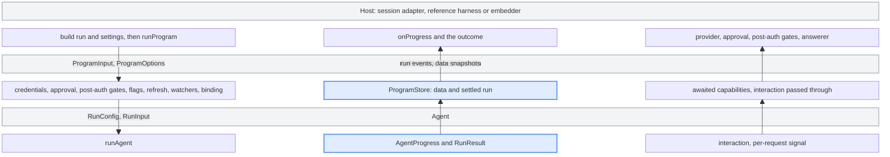

# Programs

`runProgram` runs one Wizard program invocation from data the caller supplies.
The caller builds the run definition and the program settings from the program's
`ProgramConfig`. `runProgram` owns the invocation's state, resolves the binding,
and passes the agent run to [`runAgent`](../agent/README.md). It needs no
`WizardSession` or UI store. This is a repository-local TypeScript interface.
The npm package doesn't export it as a public library API.

## Signatures

Import runtime values from `@programs` and types from `@programs/types`:

```ts
import type {
  ProgramInput,
  ProgramOptions,
  ProgramRunOutcome,
} from '@programs/types';

// The shape of `runProgram`, exported from `@programs`.
declare function runProgram(
  programId: string,
  input: ProgramInput,
  options?: ProgramOptions,
): Promise<ProgramRunOutcome>;
```

`programId` picks the binding policy, the commandments, the stage overrides and
the analytics attribution. `runProgram` doesn't look it up in a registry. An ID
with no binding runs on the default agent binding. The exact shapes are in
[`run-program.ts`](run-program.ts) and [`program-store.ts`](program-store.ts).

### Exports

| Export                                                                                                                | What it's for                                                                                |
| --------------------------------------------------------------------------------------------------------------------- | -------------------------------------------------------------------------------------------- |
| `runProgram`                                                                                                          | Run one program invocation.                                                                  |
| [`createPosthogInferenceAuthProvider`](../../docs/developer-interfaces.md#inference-authentication)                   | Mint first-party gateway auth from a PostHog login, for a host that calls `runAgent` itself. |
| `authenticate`, `FRAMEWORK_REGISTRY`, `getDetectedWarehouseSources`, `AUDIT_CHECKS_KEY`                               | Host helpers. The session adapter uses them to build the input and project the data.         |
| `PROGRAM_REGISTRY`, `Program`, `getProgramConfig`, `getSubcommandPrograms`, `getCommandPath`, `getLaunchablePrograms` | The `ProgramConfig` registry that the TUI and the CLI commands use.                          |

The type entry adds the input, option, settings, outcome and progress types
named below. It also carries the `ProgramConfig` and `ProgramRunStep` types, the
`ProgramCompletionContext` the completion hooks read, the switchboard context
type, and the `ProgramCiHost` and `ProgramRunHost` capability types.

The entry doesn't re-export the policy that `runProgram` applies. Tests and
tools import it from its module:

- `PROGRAM_BINDINGS` and `resolveProgramBinding` from [`binding.ts`](binding.ts)
- `captureSwitchboardDecision` from
  [`binding-telemetry.ts`](binding-telemetry.ts)
- `getProgramCommandments` from [`commandments.ts`](commandments.ts)
- `resolveStageOverrides` and `areSeededTasksEnabled` from
  [`experiments/`](experiments/index.ts)

### Inputs

`ProgramInput` needs `installDir` and `run`. Everything else is optional data
for this invocation.

| Field                                                            | What it carries                                                                                                                                                                                                                                                  |
| ---------------------------------------------------------------- | ---------------------------------------------------------------------------------------------------------------------------------------------------------------------------------------------------------------------------------------------------------------- |
| `installDir`                                                     | The project directory. Report paths resolve against it.                                                                                                                                                                                                          |
| `run`                                                            | The program's `AgentRunDefinition`, built by the caller from its `ProgramConfig`.                                                                                                                                                                                |
| `program`                                                        | `ProgramSettings` read from the same `ProgramConfig`. See [program settings](#program-settings).                                                                                                                                                                 |
| `credentials`                                                    | Resolved `{ posthog, inferenceAuth?, project, apiUser }`. It wins over `options.credentials`. Without `inferenceAuth`, `runProgram` mints first-party gateway auth from the refreshed login. The development `--ci` runner passes a fixed gateway token instead. |
| `runId`                                                          | Stable attribution. Generated when absent.                                                                                                                                                                                                                       |
| `overrides`                                                      | `{ harness?, sequence?, model? }` from launch flags such as `--harness`, `--sequence` and `--model`.                                                                                                                                                             |
| `composed`                                                       | Marks a sub-run of a host program. The binding clamps it to linear, and the agent leaves the outro to its host.                                                                                                                                                  |
| `skillId`, `integration`, `frameworkDocsUrl`                     | The skill to install and the detected framework.                                                                                                                                                                                                                 |
| `flags`, `host`                                                  | Run flags (`ci`, `signup`, `debug` and the rest default to `false`), and where PostHog is.                                                                                                                                                                       |
| `wizardFlags`, `wizardFlagPayloads`                              | An evaluated flag snapshot. When `wizardFlags` is absent, `runProgram` asks `options.featureFlags`.                                                                                                                                                              |
| `seedTasks`, `hooks`                                             | Tasks the orchestrator queues before the planner, and the completion hooks bound to the run's credentials.                                                                                                                                                       |
| `warehouseSources`, `discoveredFeatures`, `mayReportScanResults` | Evidence for the organization's AI SDK stamp.                                                                                                                                                                                                                    |
| `aiSdkStampReported`                                             | The host already considered the stamp for this login.                                                                                                                                                                                                            |

`runProgram` copies the input when it receives it, so a later host write can't
reach the run. Data fields are structured-cloned. `credentials`, `run`,
`program`, `hooks` and `seedTasks` stay by reference, because they can carry
functions. Any other field that can't be cloned rejects the call.

### Program settings

`input.program` carries the program-level data from `ProgramConfig`:

| Field                                                               | What `runProgram` does with it                                                                  |
| ------------------------------------------------------------------- | ----------------------------------------------------------------------------------------------- |
| `requiresAi`                                                        | `false` skips the AI-processing approval.                                                       |
| `agentFlow`, `allowedTools`, `disallowedTools`, `excludedTaskTypes` | Passed to the agent run.                                                                        |
| `auditLedgerFile`, `auditSeedChecks`                                | The ledger to watch, and the rows written to it before the agent starts.                        |
| `eventPlanFile`                                                     | The event plan to watch.                                                                        |
| `postAuthGates`                                                     | Step IDs the host settles after auth and before the agent starts, through `awaitPostAuthGates`. |

### Options

Every option is optional. Each awaited capability receives the invocation's
signal. Without `options.signal`, it gets a signal that never aborts.

| Option               | What `runProgram` does with it                                                                                                                                                                                         | When it's absent                                                     |
| -------------------- | ---------------------------------------------------------------------------------------------------------------------------------------------------------------------------------------------------------------------- | -------------------------------------------------------------------- |
| `credentials`        | Calls `resolve(programId, { signal })` once, only when `input.credentials` is absent.                                                                                                                                  | Without `input.credentials`, the run fails.                          |
| `awaitAiApproval`    | Calls it with `{ programId, signal }` when `program.requiresAi` isn't `false`, the organization hasn't approved AI data processing, and neither `flags.ci` nor `flags.signup` is set. `true` proceeds, `false` aborts. | A run that needs approval fails.                                     |
| `awaitPostAuthGates` | Calls it with `{ programId, gates, signal }` when `program.postAuthGates` is not empty.                                                                                                                                | The run doesn't pause.                                               |
| `featureFlags`       | Calls it once when the input has no `wizardFlags`. It gets no signal.                                                                                                                                                  | The run uses empty flags.                                            |
| `interaction`        | Passes it to the agent run.                                                                                                                                                                                            | The agent installs no ask bridge and declines optional task notices. |
| `onProgress`         | Sends run events and program-data snapshots. See [progress](#progress).                                                                                                                                                | The outcome still carries the settled run and the final data.        |
| `deferSkillCommit`   | Leaves the skills a successful run installed armed for removal. The host commits them later with `commitRegisteredRunSkillCleanups()` from `@shared/skill-run-cleanup`.                                                | `runProgram` commits them on success.                                |
| `signal`             | Cancels the invocation.                                                                                                                                                                                                | Nothing cancels it.                                                  |

`ProgramOptions['credentials']` and `ProgramInput['credentials']` name the
provider and resolved types. Their named types live in
[`credentials.ts`](credentials.ts).

### Outcome

`ProgramRunOutcome.outcome` is `success`, `aborted`, `failed` or `crashed`.

- **`settledRuns`.** The finished agent run, with its `runId` and `RunResult`.
- **`diagnostics`.** Up to 10 observer failures and late events, newest last.
- **`data`.** Invocation data: credentials, project and user, the framework
  context, the event plan, the binding and the AI SDK stamp latch.
- **`artifacts.reportFile`.** The absolute report path, set just before the
  agent starts. It doesn't prove the file was written.
- **`failure`.** A code and message on a failed, crashed or aborted outcome. An
  agent failure may carry the original `Error`.

Don't log `data`. It holds PostHog credentials.

### Progress

`ProgramProgress` is a union of two kinds:

- **`{ kind: 'run', runId, event }`.** One agent event. `event` is a copied
  [`AgentProgress`](../agent/README.md#signatures) value.
- **`{ kind: 'program', data }`.** A copied `ProgramInvocationData` snapshot,
  sent after each store write. It holds credentials too.

Narrow on `kind` before reading `event`. `runProgram` never awaits the observer.
A throw or a rejection becomes a bounded diagnostic in `outcome.diagnostics`. So
does an event that arrives after the run finished.

### Errors and cancellation

Most endings resolve. A rejected promise means the invocation itself broke.

- **Failed.** Missing credentials, or a run that needs approval without
  `awaitAiApproval`. A rejection from `credentials`, `awaitAiApproval`,
  `awaitPostAuthGates`, `featureFlags` or the token refresh also resolves as
  `failed`, with the error's message and code `PHW_INTERNAL_UNHANDLED`.
- **Aborted.** A declined approval returns `aborted` with code
  `PHW_AGENT_ABORT`. So does the host's signal, with the message "Run cancelled
  by host."
- **Crashed.** An agent crash. The failure carries the original `Error`.
- **Rejected.** Input that can't be cloned.

`runProgram` checks the signal before it starts and after each awaited
capability. An abort at any of those points returns `aborted`, even when the
capability has already completed. The agent run gets the signal too, and an
abort during the run returns the agent's `aborted` result.

### Example

The caller builds the run from the program's config, and implements
`credentials` and `awaitAiApproval` with its own login and consent flow:

```ts
import { getProgramConfig, runProgram } from '@programs';
import type { ProgramOptions } from '@programs/types';

export async function runMetrics(
  installDir: string,
  credentials: NonNullable<ProgramOptions['credentials']>,
  awaitAiApproval: NonNullable<ProgramOptions['awaitAiApproval']>,
  signal?: AbortSignal,
) {
  // A dynamic run resolves from session-shaped data and a ProgramRunHost.
  const config = getProgramConfig('metrics');
  if (!config.run || typeof config.run === 'function') {
    throw new Error('metrics has a static run definition');
  }

  const result = await runProgram(
    config.id,
    {
      installDir,
      run: config.run,
      program: { agentFlow: config.agentFlow, requiresAi: config.requiresAi },
    },
    {
      credentials,
      awaitAiApproval,
      signal,
      onProgress: (progress) => {
        if (progress.kind !== 'run') return;
        const { runId, event } = progress;
        if (event.kind === 'status') console.log(runId, event.message);
      },
    },
  );

  if (result.outcome !== 'success') {
    if (result.failure?.error) throw result.failure.error;
    throw new Error(result.failure?.message ?? `Metrics ${result.outcome}`);
  }
  return result;
}
```

## Intent

A host calls `runProgram` to run a program without a TUI session. The host
decides where credentials, answers and consent come from, and which run it
passes. `runProgram` decides how that run goes: its policy, binding, files and
progress.

Today's callers:

- **The session adapter.** `src/cli/runners/run-program-agent.ts` serves the TUI
  and the `--ci` runner. It resolves `ProgramConfig.run` against the session and
  a `ProgramRunHost`, runs the health and settings gates, and reads the program
  settings from the config. The health check and the post-auth gates come from
  the program's TUI flow in `src/tui/flows`. It supplies the session's login as
  the credentials provider, answers approval and post-auth gates from the TUI,
  and maps progress back onto `getUI()`.
- **The workbench harness.** `pnpm wizard-program` in
  [wizard-workbench](https://github.com/PostHog/wizard-workbench) is a reference
  host with no TUI.

A missing capability never hangs the run and never invents consent. A program
that needs approval fails without `awaitAiApproval`. A run with no `interaction`
asks no questions. A run with no `onProgress` still returns its settled run and
final data in the outcome.

`flags.ci` and `flags.signup` skip the approval check. Set them only when your
CI authorization or signup flow already handled consent. The flags don't prove
consent.

## Architecture

One invocation owns one `ProgramStore`. The host observes a copy of the store
through `onProgress` and the outcome, never the store itself.



Calls go down the left. Progress comes up the middle. Questions go up the right.

`runProgram` works in this order:

1. Copy the input, register the skill cleanup, and check the signal.
2. Resolve credentials, identify the user for analytics, and stamp the AI SDK
   evidence once per invocation.
3. Await AI approval and the post-auth gates when they apply.
4. Load flags, and refresh the OAuth token when it has less than 50 minutes
   left.
5. Start the file watchers and seed the audit ledger.
6. Resolve the binding from `overrides` and flags, and capture the switchboard
   decision.
7. Call `runAgent`, record the result, and stop the watchers.

`runProgram` is the only owner of the program file watchers. It watches the
audit ledger (`.posthog-audit-checks.json`) and the event plan
(`.posthog-events.json`) while the agent runs. A ledger that an earlier run left
behind is ignored until this run writes it. Updates land in the store as the
`auditChecks` framework context and the event plan.

Each invocation registers a skill cleanup for its install directory. A
non-success outcome, a rejection or a process drain removes the Wizard skills
the invocation added. Skills that existed before stay.

`runProgram` sends the `agent started` event and the switchboard decision. It
doesn't send the terminal `setup wizard finished` event. The host sends it from
the outcome.

`ProgramCiHost` and `ProgramRunHost` belong to the `ProgramConfig` path, not to
`runProgram`. `ProgramCiHost` supplies logging, auth and progress while a CI
pre-run scopes the project. `ProgramRunHost` supplies the live UI effects a
legacy recipe reads while its run definition resolves. The completion hooks read
a `ProgramCompletionContext` built when each hook runs, so URLs the run emitted
reach them.

The programs layer imports the agent only through `@agent` and `@agent/types`.
Its other imports come from `src/shared` and `src/env.ts`.

## Current limits

`runProgram` doesn't discover credentials, choose a project or render questions.
The host supplies those through data and capabilities.

One call runs one agent. Composition belongs to the host: the TUI walks a
composed step, one whose `ProgramConfig.runSteps` entry names a `runProgramId`,
as its own call with `composed: true`. Programs with no agent, such as
`posthog-doctor`, `mcp-add` and `slack`, don't go through `runProgram`. The TUI
runs their steps.

Agentic detection runs before `runProgram`, as its own `runAgent` call with a
deadline per attempt. The MCP suggested-prompts screen streams through
`runMcpPromptViaSdk`, a separate SDK path. There is no socket controller and no
step-by-step control API.

For the process-owned `--ci` runner, see the
[non-interactive developer interfaces](../../docs/developer-interfaces.md).
